# **Tabla de contenidos**

1. [Introducción](#id1)
2. [Propósito de la práctica](#id2)
3. [Materiales y equipos](#id3)\
     3.1 [Conexión usada](#id4)\
4. [Resultados y limitaciones](#id5)\
     4.1 [Actividad muscular del deltoides medial según la literatura](#id6)\
     4.2 [Videos de los movimientos realizados para el deltoides](#id7)\
     4.3 [Ploteo de la señal en OpenSignal del deltoides](#id8)\
     4.4 [Actividad muscular del bíceps braquial según la literatura](#id9)\
     4.5 [Videos de los movimientos realizados para el bíceps](#id10)\
     4.6 [Ploteo de la señal en OpenSignal del bíceps](#id11)\
     4.7 [Discusión](#id12)\
7. [Referencias](#id13)

## **Introducción** 
*La electromiografía (EMG) es una técnica para registrar señales eléctricas biomédicas obtenidas de la actividad eléctrica neuromuscular (conjunto de interacciones entre el sistema nervioso y los músculos esqueleticos del cuerpo humano) durante su contracción [1]. Las señales registradas pueden utilizarse en aplicaciones clínicas y biomédicas si se dispone de métodos de detección, descomposición, procesamiento y clasificación. Por ejemplo, a menudo se emplean con la velocidad de la conducción nerviosa para detectar problemas musculares o nerviosos [2], pero las más comunes son monitorizar anomalías médicas y niveles de activación, así como para analizar la biomecánica [1].*

*En la electromiografía se mide la actividad eléctrica del músculo en reposo, con una contracción leve y con una contracción fuerte. El patrón de la señal EMG producida puede variar según la actividad muscular, por ello normalmente el tejido muscular no genera señales eléctricas mientras está en reposo [2].*

*El principio detras de esta medición se basa en la despolarización de las fibras musculares, donde los potenciales de acción viajan a lo largo de las motoneuronas hacia la unión neuromuscular, desencadenando la contracción muscular y consigo la producción de la actividad eléctrica que se puede sensar con la EMG. Por ello se usan electrodos para medir esos potenciales de acción, los cuales se amplifican y procesan [3].*

## **Propósito de la práctica** 

* Adquirir señales biomédicas de EMG de músculos con menor indice de confusión técnica.
* Hacer una correcta configuración de BiTalino.
* Extraer la información de las señales EMG del software OpenSignals (r)evolution

## **Materiales y métodos** 

|       **Materiales**      | **Cantidad** |
|:-------------------------:|:------------:|
| (R)EVOLUTION Kit BITalino |       1      |
|           Laptop          |       1      |
|          Aplicación -     |       1      |
| Electrodos de superficie  |       5      |

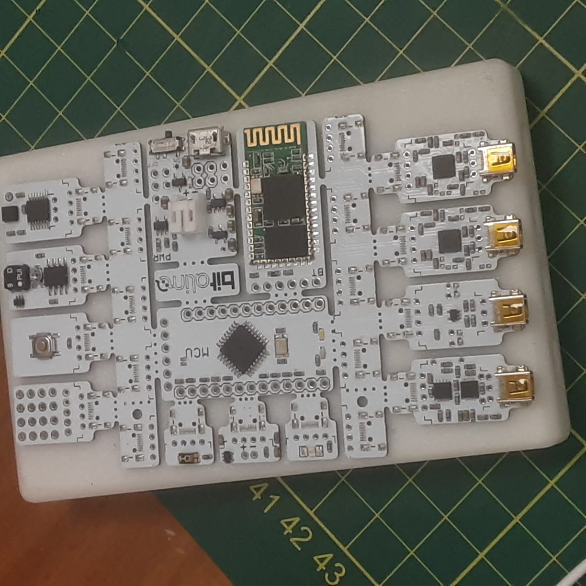

<i>Figura 1. Fotografías del bitalino, vista delantera y posterior.</i>

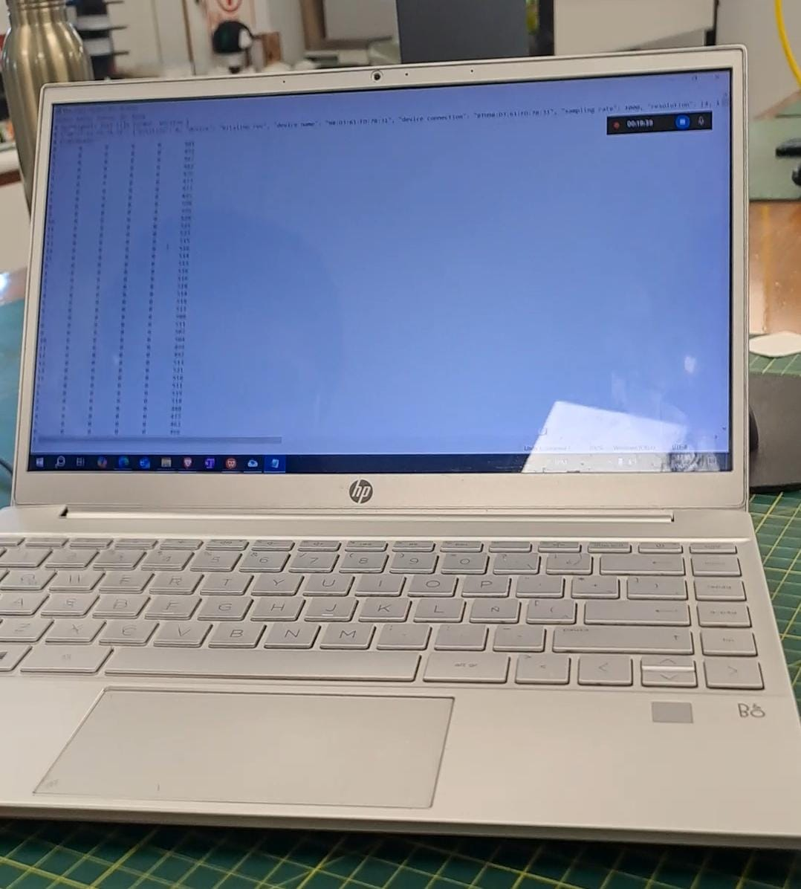

<i>Figura 2. Fotografía de la laptop con la aplicación instalada.</i>

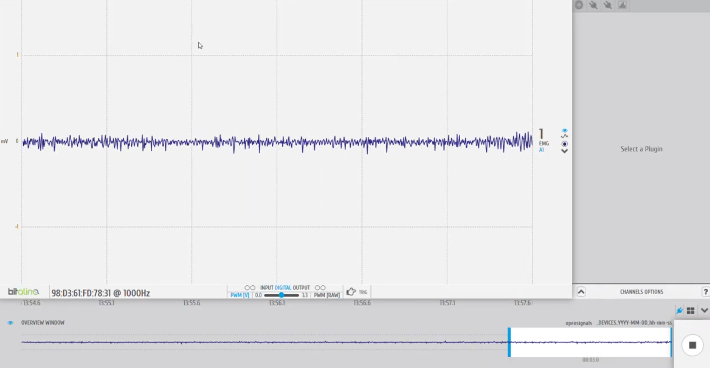

<i>Figura 3. Fotografía de la aplicación usada.</i>

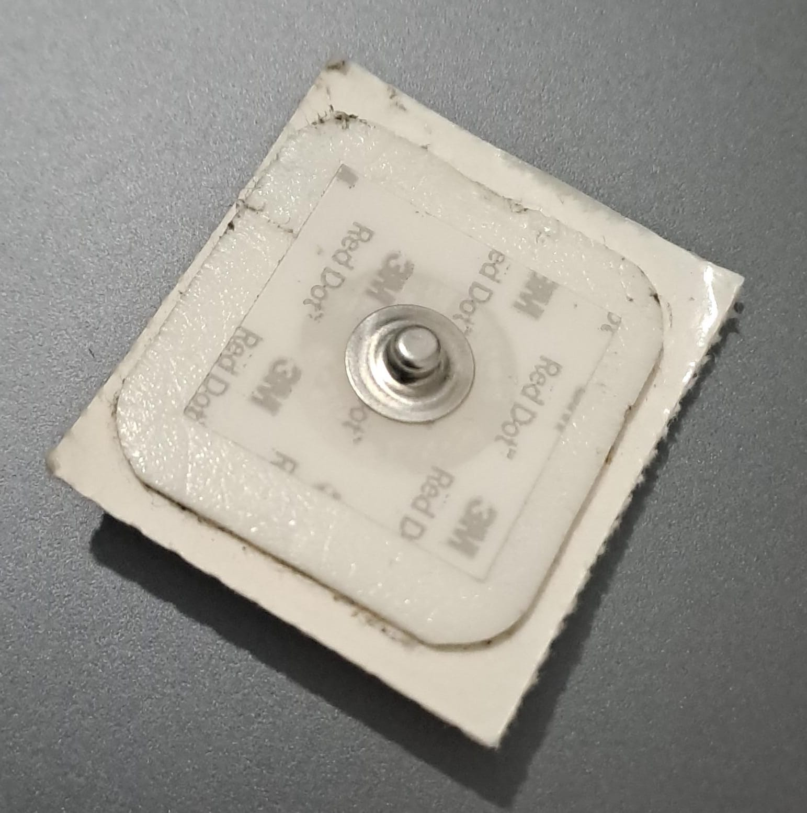

<i>Figura 4. Fotografía del tipo de electrodo a usar. Se utilizaron 5 de este tipo.</i>

### **Conexión usada** 

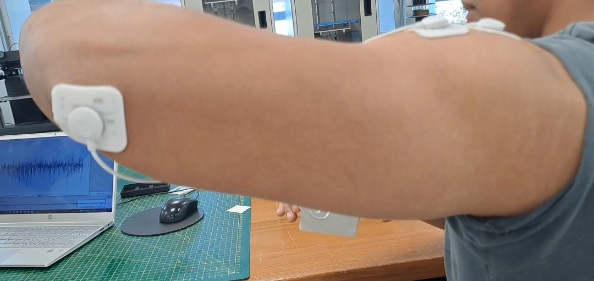

<i>Figura 5. Fotografía de la ubicación del electrodo de referencia.</i>

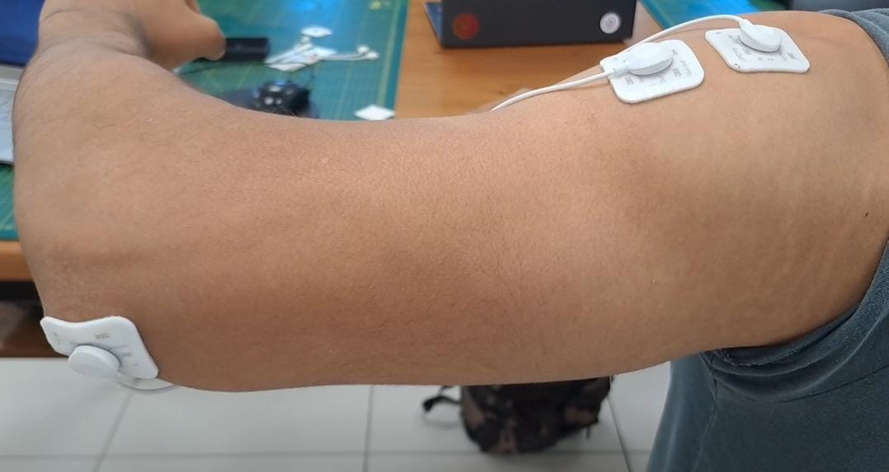

<i>Figura 6. Fotografía de la ubicación de los electrodos positivos y negativos en el músculo deltoides.</i>

La medición del EMG del Deltoides se realizó con el participante de pie, manteniendo el brazo relajado al costado del cuerpo. Se colocaron electrodos de superficie en la región del Deltoides para captar la actividad eléctrica del músculo durante la contracción y el reposo.

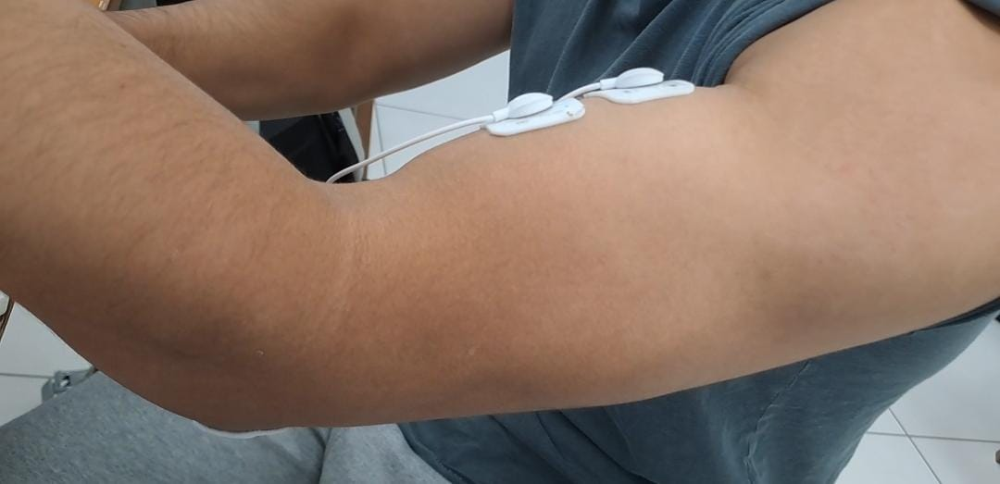

<i>Figura 7. Fotografía de la ubicación de los electrodos positivos y negativos en el músculo biceps.</i>

Se utilizó el EMG del bitalino

La señal EMG en el deltoides medial es fácil de registrar por su localización superficial y su forma relativamente constante. La correcta colocación del electrodo, recomendada por las guías de Plux y BITalino, se realiza en la parte más prominente del músculo, a medio camino entre el acromion y la inserción deltoidea en el húmero, con los electrodos colocados paralelos a las fibras musculares【7】【8】.

La colocación adecuada de los electrodos también es clave en el biceps. Según Proença y Mrotzeck (2021), se recomienda ubicar los electrodos paralelos a las fibras musculares del bíceps, aproximadamente en el centro del vientre muscular, siguiendo lineamientos del proyecto SENIAM para garantizar registros fiables y comparables【7】.

## **Resultados y limitaciones:**

### **1. Actividad muscular del deltoides medial según la literatura:**

El deltoides medial es el principal responsable de la abducción del hombro en el plano frontal. Su actividad electromiográfica (EMG) es especialmente relevante en ejercicios como elevaciones laterales, levantamientos con carga y gestos deportivos que implican separación del brazo del tronco.

En el estudio de Roldán (2017), aunque se centra en el deltoides en general, se describe que durante el gesto técnico del placaje en rugby, la porción medial del deltoides presenta picos de activación significativos cuando el brazo se proyecta lateralmente. La actividad EMG se intensifica conforme aumenta la carga aplicada, con una frecuencia media (MF) que supera los 90 Hz en situaciones de esfuerzo máximo【4】.

Por su parte, Guzmán-Muñoz y Méndez-Rebolledo (2018) destacan que el deltoides medial muestra una respuesta electromiográfica muy clara y robusta ante ejercicios funcionales de tipo isométrico o isotónico, como la elevación del brazo en abducción. Se reporta una progresión en la amplitud RMS y en la frecuencia mediana (MDF) desde estados de reposo (~30–40 Hz) hasta esfuerzos elevados (~100–120 Hz)【3】.

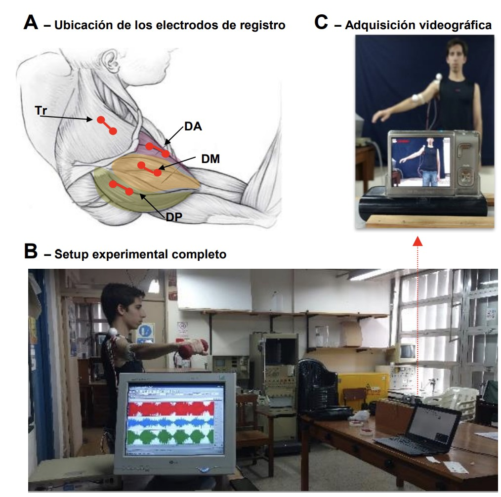

<i>Figura 1. A) Ubicación de los electrodos de registro en el músculo deltoides, específicamente en sus porciones anterior (DA), medial (DM) y posterior (DP), siguiendo la disposición recomendada por el estudio de Roldán (2017), basada en protocolos SENIAM. B) Montaje experimental durante la ejecución de ejercicios de abducción con carga progresiva. C) Registro videográfico del gesto técnico en plano frontal para control postural y análisis cinemático complementario.</i>

<i>Figura 2. Representación de la señal EMG registrada en el deltoides medial durante el movimiento de abducción del brazo en tres condiciones: i) sin peso, ii) con carga mínima, y iii) con carga máxima. Se observa un incremento progresivo tanto en la amplitud como en la densidad espectral de la señal EMG, lo cual refleja un mayor reclutamiento de unidades motoras ante el aumento de la carga..</i>

### 🏋️‍♂️ Datos fisiológicos del Deltoides Medial (basados en Roldán, 2017 y Guzmán-Muñoz & Méndez-Rebolledo, 2020)

| Condición muscular            | Frecuencia media (Hz) | Amplitud RMS estimada     |
|-------------------------------|------------------------|----------------------------|
| Reposo                        | ~30–40                 | Baja (~100–300 μV)*        |
| Abducción con carga moderada  | ~60–90                 | Media (~400–800 μV)*       |
| Abducción con carga elevada   | ~100–120               | Alta (~900–1500+ μV)*      |

### **Videos de los movimientos realizados para el deltoides:**
   

### **Ploteo de la señal en OpenSignal del deltoides:**

   
| **Posición** | **Señal** |
|:------------:|:---------:|
| **Reposo** | 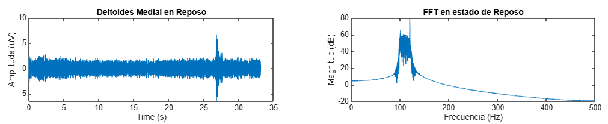 |
| **Movimiento** |  |
| **Fuerza** | 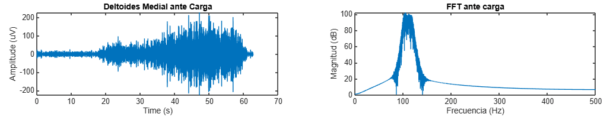 |

<i>Tabla 3. Señales del deltoides medial adquiridas en reposo, flexión y carga graficadas en matlab</i>

### **2. Actividad muscular del bíceps braquial según la literatura:**

 El bíceps braquial es un músculo biarticular que participa en movimientos de flexión del codo y supinación del antebrazo. Por su importancia funcional, ha sido ampliamente estudiado mediante electromiografía (EMG), permitiendo evaluar su actividad en condiciones de reposo, carga leve y carga máxima.

En el trabajo de Domínguez Jiménez (2015), se analiza la señal EMG del bíceps durante la ejecución de ejercicios con mancuernas, encontrando un incremento progresivo en la amplitud y frecuencia de la señal conforme aumenta la carga. El estudio reporta una frecuencia media (MF) que va desde los 30–60 Hz en contracción leve, hasta valores superiores a los 100 Hz en contracciones máximas, con una amplitud promedio que puede superar los 1500 μV bajo carga intensa【6】.

Por otro lado, el estudio de Khodadadi et al. (2023) explora el comportamiento del bíceps braquial bajo estimulación artificial utilizando la ecuación caótica de Rossler. En este caso, se genera una señal EMG con características no lineales y frecuencias superiores a 120 Hz, útiles para el análisis de patrones complejos en contextos como el desarrollo de prótesis inteligentes o clasificación de señales patológicas【5】.

Además, las guías clínicas de Cleveland Clinic y Johns Hopkins Medicine confirman que el análisis EMG del bíceps es fundamental para diagnosticar lesiones musculares, evaluar el rendimiento motor y personalizar la rehabilitación【1】【2】.

Por último, Guzmán-Muñoz y Méndez-Rebolledo (2018) subrayan el uso de EMG en ciencias de la rehabilitación, considerando al bíceps braquial como músculo clave en la restauración de funciones básicas del miembro superior en pacientes con daño neuromuscular【3】.

<i>Figura 6. Disposición anatómica de los electrodos para el registro electromiográfico del bíceps braquial. Los electrodos activos se colocan paralelos a las fibras musculares, centrados en el vientre del músculo, con una separación de aproximadamente 2 cm entre ellos, tal como lo establece el protocolo SENIAM. El electrodo de referencia (masa) se posiciona en una zona ósea neutra del antebrazo.</i>

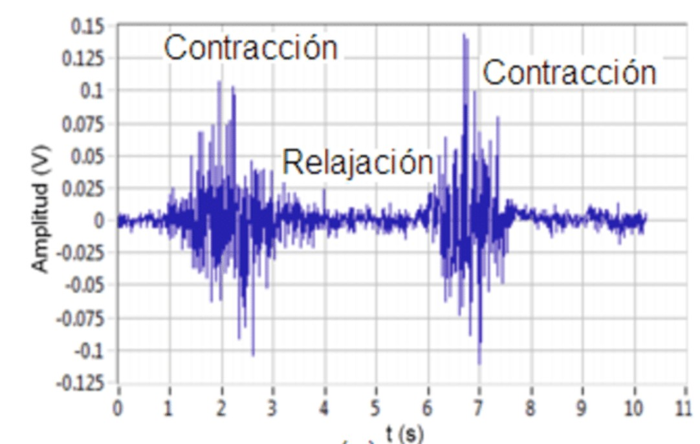

<i>Figura 7. Registro de la señal electromiográfica superficial del bíceps braquial durante una secuencia de contracción voluntaria, relajación y nueva contracción. Se evidencia un aumento significativo en la amplitud de la señal (hasta 0.125 V) durante las fases activas, con reducción casi total en los períodos de reposo, lo cual refleja un patrón de activación típico en ejercicios de flexión de codo bajo carga moderada.</i>

###   Datos fisiológicos del Bíceps Braquial (según literatura)
| Condición muscular           | Frecuencia media (Hz) | Amplitud media (μV)       |
|-----------------------------|------------------------|----------------------------|
| Descanso                    | ~20–40                 | Baja (~100–300 μV)         |
| Contracción leve            | ~30–60                 | ~200–500 μV                |
| Contracción fuerte          | ~60–110                | ~600–1500 μV               |

#### <blockquote> Prueba 02: Bíceps braquial / Nervio mediano

<i>Figura 7: La medición del EMG del nervio mediano se realizó con el participante en una posición sentada, manteniendo una postura natural con los codos apoyados en los reposabrazos y la cabeza en una posición neutral para minimizar la interferencia de otros movimientos.</i>

### **Videos de los movimientos realizados para el bíceps:**

### **Ploteo de la señal en OpenSignal del bíceps:**

   
| **Posición** | **Señal** |
|:------------:|:---------:|
| **Reposo** |  |
| **Movimiento** | 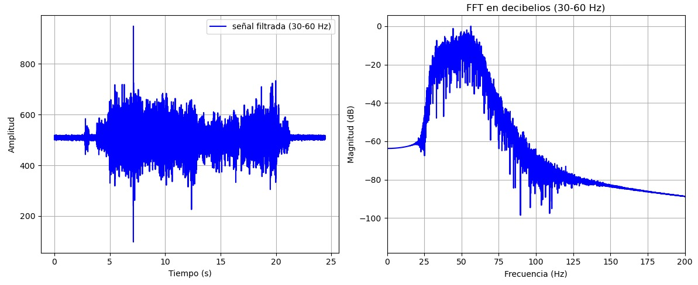 |
| **Fuerza** |  |

<i>Tabla 7. Señales adquiridas en reposo, sin oposición y con oposición graficadas en Python</i>

## **Discusión:**

Para este laboratorio, se utilizó el sistema BITalino para la adquisición de señales EMG, capturando y analizando la actividad en distintos grupos musculares bajo diversas condiciones. La EMG de superficie ofrece una técnica no invasiva para medir la actividad eléctrica muscular, proporcionando información valiosa sobre la fisiología y función de los músculos. Al realizar las pruebas en cada músculo, se observó una variabilidad significativa en las características de activación y las respuestas, lo que demuestra que cada músculo tiene un comportamiento único frente a diferentes condiciones de esfuerzo. Además, cada señal obtenida fue graficada mediante un código en Python, permitiendo visualizar la señal a lo largo del tiempo y asi poder ver los distintos músculos. Estos resultados destacan la importancia de un análisis individual para comprender mejor la función de cada musculo.

## **Referencias** 
1. Gohel V, Mehendale N. Review on electromyography signal acquisition and processing. Biophys Rev. 2020 Nov 10;12(6):1361–7. doi: 10.1007/s12551-020-00770-w. Epub ahead of print. PMID: 33169207; PMCID: PMC7755956. Disponible en: https://pmc.ncbi.nlm.nih.gov/articles/PMC7755956/
   
2. Johns Hopkins Medicine. Electromyography (EMG) [Internet]. Johns Hopkins Medicine; [citado 12 abr 2025]. Disponible en: https://www.hopkinsmedicine.org/health/treatment-tests-and-therapies/electromyography-emg

3. Mayo Clinic. Electromiografía. [En línea] Disponible en: https://www.mayoclinic.org/es/tests-procedures/emg/about/pac-20393913.
   
4. Cleveland Clinic. EMG (Electromyography): What It Is, Purpose, Procedure & Results [Internet]. Cleveland Clinic; [citado 12 abr 2025]. Disponible en: https://my.clevelandclinic.org/health/diagnostics/4825-emg-electromyography

5. Guzmán-Muñoz E, Méndez-Rebolledo G. Electromiografía en las Ciencias de la Rehabilitación. *Rev Salud Uninorte* [Internet]. 2018 [citado 12 abr 2025];34(3):753–765. Disponible en: https://www.redalyc.org/journal/817/81759607022/html/

6. Roldán EJ. Actividad electromiográfica del músculo deltoides en jugadores de rugby amateur durante el gesto técnico del placaje [Internet]. CONICET; 2017 [citado 12 abr 2025]. Disponible en: https://ri.conicet.gov.ar/bitstream/handle/11336/57638/CONICET_Digital_Nro.fc60ec59-4154-4aa8-91b4-e8fcf4184a4e_A.pdf

7. Khodadadi V, Nowshiravan Rahatabad F, Sheikhani A, Jafarnia Dabanloo N. A dataset of a stimulated biceps muscle of electromyogram signal by using Rossler chaotic equation. *Data Brief*. 2023;49:109438. doi:10.1016/j.dib.2023.109438

8. Domínguez Jiménez JA. Análisis de las señales EMG de superficie del bíceps durante la ejecución de ejercicios con pesas [Internet]. Cartagena: Universidad Tecnológica de Bolívar; 2015 [citado 12 abr 2025]. Disponible en: https://biblioteca.utb.edu.co/notas/tesis/0069071.pdf

9. Proença M, Mrotzeck K. BITalino (r)evolution Lab Guide: Home Guide 1 – EMG [Internet]. Lisbon: PLUX – Wireless Biosignals, S.A.; 2021 [citado 12 abr 2025]. Disponible en: https://support.pluxbiosignals.com/wp-content/uploads/2022/04/HomeGuide1_EMG.pdf

10. biosignalsplux. Manual del usuario del sensor de electromiografía (EMG) [Internet]. 2021 [citado 12 abr 2025]. Disponible en: https://manuals.plus/es/biose%C3%B1ales/manual-del-sensor-de-electromiograf%C3%ADa-emg#axzz7y3EF2MKZ
