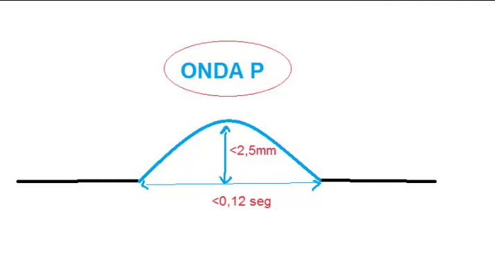
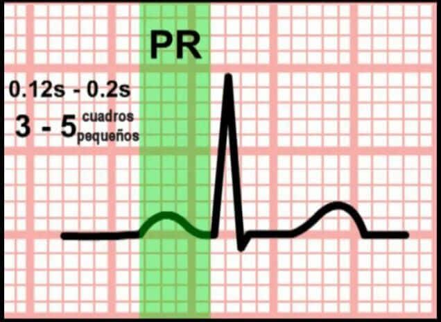
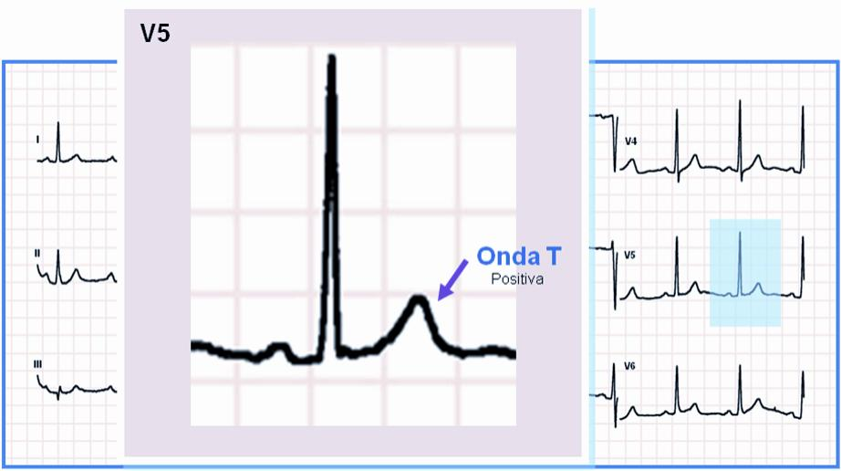

# **LABORATORIO 4: – Uso de BiTalino para EMG y ECG**

# **Tabla de contenidos**
1. [Introducción](#id0)
2. [Objetivos](#id1)
3. [Materiales y equipos](#id2)
4. [Procedimiento](#id3)
5. [Resultados](#id4)\
     4.1 [Conexión usada](#id5)\
     4.2 [Video de la señal](#id6)\
     4.3 [Ploteo de la señal en OpenSignal](#id7)\
     4.4 [Archivos](#id8)\
     4.5 [Ploteo de la señal en Python](#id9)
6. [Conclusiones](#id10)
7. [Referencias](#id11)

## **Introducción al laboratorio** 
---

El electrocardiograma (ECG) es una herramienta fundamental en la medicina moderna que permite registrar la actividad eléctrica del corazón a lo largo del tiempo. Esta actividad eléctrica es esencial para la contracción coordinada del músculo cardíaco, y su análisis proporciona información valiosa sobre el estado fisiológico del corazón .

El trazado típico de un ECG consta de varias ondas y complejos que representan diferentes fases del ciclo cardíaco: la onda P indica la despolarización auricular, el complejo QRS refleja la despolarización ventricular, y la onda T corresponde a la repolarización ventricular . La interpretación adecuada de estos componentes es crucial para el diagnóstico de diversas patologías cardíacas, como arritmias, infartos de miocardio y otras condiciones que afectan la conducción eléctrica del corazón.

     

---

### ⚡ Componentes del Electrocardiograma (ECG)

El electrocardiograma (ECG) es una herramienta de diagnóstico que permite registrar la actividad eléctrica del corazón a través de un conjunto de ondas, segmentos e intervalos. Cada uno de estos componentes representa distintos eventos fisiológicos del ciclo cardíaco. Comprender su significado es esencial para interpretar correctamente el trazado del ECG.

| Componente     | Descripción |
|----------------|-------------|
| **Onda P**     | Representa la despolarización auricular, es decir, el impulso eléctrico que activa las aurículas. |
| **Complejo QRS** | Refleja la despolarización ventricular. Incluye la activación del tabique interventricular (Q), masa ventricular principal (R), y regiones finales (S). |
| **Onda T**     | Representa la repolarización de los ventrículos, preparándolos para el siguiente ciclo. |
| **Segmento PR** | Tiempo entre el final de la onda P y el inicio del QRS; muestra la conducción desde aurículas a ventrículos. |
| **Segmento ST** | Pausa eléctrica entre la despolarización y repolarización ventricular; útil para detectar isquemia. |
| **Intervalo PR** | Desde el inicio de la onda P hasta el inicio del QRS; indica el tiempo total de conducción auriculoventricular. |
| **Intervalo QT** | Incluye QRS, ST y T; muestra la duración total de la despolarización y repolarización ventricular. |
| **Intervalo RR** | Distancia entre dos ondas R consecutivas; se utiliza para calcular la frecuencia cardíaca. |

  

Figura 1. Componentes de un EKG

### ❓ ¿Cómo se interpreta el ECG?

El electrocardiograma (ECG) permite identificar la actividad eléctrica del corazón mediante la medición de diferentes ondas e intervalos. La siguiente tabla resume la interpretación y valores fisiológicos normales de cada componente del ECG, junto con sus respectivas imágenes.

| Componente        | Interpretación                                                                                     | Imagen |
|------------------|-----------------------------------------------------------------------------------------------------|--------|
| **Onda P**        | - Despolarización auricular    - Duración: ~0.12 s   - Amplitud: ~0.25 mV                     |  Figura 2. Onda P |
| **Intervalo PR**  | - Desde el inicio de la onda P hasta el inicio del QRS    - Duración: 0.12 – 0.20 s              |  Figura 3. Intervalo PR |
| **Complejo QRS**  | - Despolarización ventricular    - Duración: ~0.10 s    - Evalúa bloqueos y arritmias         |  Figura 4. Complejo QRS |
| **Segmento ST**   | - Pausa entre despolarización y repolarización ventricular    - Alteraciones indican isquemia    |  Figura 5. Segmento ST |
| **Onda T**        | - Repolarización ventricular    - Altura: &lt;5 mm (frontales), &lt;15 mm (precordiales)         |  Figura 6. Onda T |
| **Intervalo RR**  | - Tiempo entre dos ondas R consecutivas    - Se usa para calcular la frecuencia cardíaca         |  Figura 7. Intervalo RR |
| **Intervalo QT**  | - Desde inicio del QRS hasta final de onda T    - QTc normal: hasta 450 ms (H), 470 ms (M)       |  Figura 8. Intervalo QT |

## **Objetivos** 
---
Los objetivos del laboratorio son:
* Adquirir señales biomédicas de ECG.
* Hacer una correcta configuración de BiTalino.
* Extraer la información de las señales ECG del software OpenSignals (r)evolution 

## **Materiales y equipos** 

---

|  **Imagen**  | **Producto** | **Cantidad** |
|:------------:|:---------------:|:------------:|
|  |   Kit BITalino  |       1      |
|  |      Laptop     |       1      |
|  |      Electrodos    |       5     |

## **Procedimiento** 

Para la colocación de los electrodos se siguió la guía oficial de BITalino: *"BITalino HOME-GUIDE #2: ELECTROCARDIOGRAPHY (ECG) - Exploring Cardiac Signals at the Skin Surface"*.

La señal ECG se registró dos veces en cada uno de los siguientes estados:

- **Estado basal**: reposo completo.  
- **Respiración controlada**: ciclos de inhalación y exhalación de 15 segundos.  
- **Ejercicio intenso**: actividad física durante 6 minutos.  
- **Respiración prolongada**: apnea involuntaria hasta ahogarse.  

---

## **Resultados** 

### **Conexión usada** 
#

Se posicionaron los electrodos en base las guías mencionadas:

Figura 6. Posición de los electrodos según la guía.

Figura 7. Muestra una configuración del sensor de ECG BiTalino para la derivación I de Einthoven.
    

### 🎥 Videos de la adquisición organizados por condición

### 🎥 Videos de la adquisición organizados por condición y derivada

| Condición              | Derivada           | Primer muestreo                                               | Segundo muestreo                                              |
|------------------------|--------------------|----------------------------------------------------------------|----------------------------------------------------------------|
| **Estado basal**       | Primera derivada   | <video src="https://user-images.githubusercontent.com/89707896/231572641-61aeebae-f397-4627-aebc-913bb9464915.mp4" width="200" controls></video> | <video src="https://user-images.githubusercontent.com/89707896/231574043-44222491-d595-4d5a-9ac8-112adb20757c.mp4" width="200" controls></video>                  |
|                        | Segunda derivada   | <video src="#" width="200" controls></video>                  | <video src="#" width="200" controls></video>                  |
|                        | Tercera derivada   | <video src="#" width="200" controls></video>                  | <video src="#" width="200" controls></video>                  |
| **Resp. controlada**   | Primera derivada   | <video src="#" width="200" controls></video>                  | <video src="#" width="200" controls></video>                  |
|                        | Segunda derivada   | <video src="#" width="200" controls></video>                  | <video src="#" width="200" controls></video>                  |
|                        | Tercera derivada   | <video src="#" width="200" controls></video>                  | <video src="#" width="200" controls></video>                  |
| **Ejercicio intenso**  | Primera derivada   | <video src="#" width="200" controls></video>                  | <video src="#" width="200" controls></video>                  |
|                        | Segunda derivada   | <video src="#" width="200" controls></video>                  | <video src="#" width="200" controls></video>                  |
|                        | Tercera derivada   | <video src="#" width="200" controls></video>                  | <video src="#" width="200" controls></video>                  |
| **Resp. prolongada**   | Primera derivada   | <video src="#" width="200" controls></video>                  | <video src="#" width="200" controls></video>                  |
|                        | Segunda derivada   | <video src="#" width="200" controls></video>                  | <video src="#" width="200" controls></video>                  |
|                        | Tercera derivada   | <video src="#" width="200" controls></video>                  | <video src="#" width="200" controls></video>                  |

### **Ploteo de la señal en OpenSignal** 

| Condición              | Derivada           | Primer muestreo                                               | Segundo muestreo                                              |
|------------------------|--------------------|----------------------------------------------------------------|----------------------------------------------------------------|
| **Estado basal**       | Primera derivada   | <video src="https://user-images.githubusercontent.com/89707896/231572641-61aeebae-f397-4627-aebc-913bb9464915.mp4" width="200" controls></video> | <video src="https://user-images.githubusercontent.com/89707896/231574043-44222491-d595-4d5a-9ac8-112adb20757c.mp4" width="200" controls></video>                  |
|                        | Segunda derivada   | <video src="#" width="200" controls></video>                  | <video src="#" width="200" controls></video>                  |
|                        | Tercera derivada   | <video src="#" width="200" controls></video>                  | <video src="#" width="200" controls></video>                  |
| **Resp. controlada**   | Primera derivada   | <video src="#" width="200" controls></video>                  | <video src="#" width="200" controls></video>                  |
|                        | Segunda derivada   | <video src="#" width="200" controls></video>                  | <video src="#" width="200" controls></video>                  |
|                        | Tercera derivada   | <video src="#" width="200" controls></video>                  | <video src="#" width="200" controls></video>                  |
| **Ejercicio intenso**  | Primera derivada   | <video src="#" width="200" controls></video>                  | <video src="#" width="200" controls></video>                  |
|                        | Segunda derivada   | <video src="#" width="200" controls></video>                  | <video src="#" width="200" controls></video>                  |
|                        | Tercera derivada   | <video src="#" width="200" controls></video>                  | <video src="#" width="200" controls></video>                  |
| **Resp. prolongada**   | Primera derivada   | <video src="#" width="200" controls></video>                  | <video src="#" width="200" controls></video>                  |
|                        | Segunda derivada   | <video src="#" width="200" controls></video>                  | <video src="#" width="200" controls></video>                  |
|                        | Tercera derivada   | <video src="#" width="200" controls></video>                  | <video src="#" width="200" controls></video>                  |

### **Archivos** 
Se encuentran en la carpeta del laboratorio 4.
#
### **Ploteo de la señal en Python** 

a) Estado basal  
Se observa el complejo QRS el cual indica un tiempo corto de despolarización de los ventrículos, lo que indicaría un corto periodo de movimiento dentro de estas cavidades. Asimismo, se observa una alta presencia de ruido en la región del ST, además existe una especie de pendiente en el segmento isoeléctrico lo que indicaría algo de actividad en el ventrículo incluso cuando no hay electricidad fluyendo a través de él. Por último también se llegaría a notar una onda T, representativa de la repolarización de los ventrículos. [5]

| Ploteo del primer intento | Ploteo del segundo intento |
|---------------------------|----------------------------|
|  Figura 12. Señal en estado basal |  Figura 13. Señal en estado basal (FFT) |

     

     b)   Manteniendo la respiración por 10 segundos
La inspiración profunda puede generar cambios tanto en la posición como en la orientación del corazón a través de un desplazamiento hacia abajo del diafragma que afectan la señal ECG. Estos cambios pueden observarse entre los 35 a 45 segundos en la siguiente gráfica [6].
 

     

Figura 14. Ploteo de la señal en Python manteniendo la respiración por 10 segundos

           

Figura 15. Ploteo de la señal en Python manteniendo la respiración por 10 segundos FFT.

 

     c)   Reposo basal
En la interpretación de la señal en el reposo basal tras la respiración se puede observar una onda P superior al estado basal por lo que se puede deducir que en este caso existe una mayor despolarización auricular indicando mayor movimiento en estas cavidades debido a la recepción de sangre por parte del corazón. Posteriormente observamos una mayor amplitud entre los picos R y S dentro del complejo QRS lo que indicaría que existiría una mayor actividad en las ventriculas esto debido al mayor volumen de sangre que habían recibido las aurículas previamente antes de pasar por las válvulas. Por último, también son visibles las ondas T teniendo una alta actividad debido a la gran actividad llevada a cabo por los ventrículos previamente [5]  

     

Figura 16. Ploteo de la señal en Python en reposo basal

     
     
  
     d)   Después de una actividad física
El aumento de frecuencia cardiaca debido al ejercicio físico desencadena cambios en la señal ECG como una mayor amplitud de la onda Q, disminución del intervalo RR, ondas T altas y puntiagudas, superposición de ondas P y ondas T [7].

     

Figura 17. Ploteo de la señal en Python después de una actividad física

     

Figura 18. Ploteo de la señal en Python después de una actividad física

   
  

Figura 19. Ploteo de la señal en Python despues de una actividad física FFT.

 

      e)Simulacion
En la simulación del ejercicio son visibles la mayoría de segmentos y ondas de los dos estados anteriores, sin embargo, en este es visible, además de la falta de ruido, existe una menor diferencia entre los picos R y el  S dentro del complejo QRS en comparación a los datos obtenidos de la voluntaria en cuyo caso la diferencia es mucho mayor. También se puede notar una bastante visible y prolongada, que va de acuerdo a los altos picos dentro del segmento QRS. [5]

     

Figura 20. Ploteo de la simulación.

Figura 21. Ploteo de la señal en Python de la simulación FFT.

 

## Analisis de las gráficas FFT 
Las gráficas de FFT obtenidas experimentalmente (estado de reposo, respiración profunda y post ejercicio) son muy similares entre sí. Sin embargo, al compararlas con el simulador se puede observar la diferencia en el rango inicial del espectro. Aproximadamente, entre 0-25 Hz. Se ha comprobado que esta respuesta a la frecuencia es la que se debería obtener al filtrar la señal de forma correcta. Artículos indican que la forma de la densidad espectral es similar. Como se puede observar en la tercera gráfica, en la que se realizó un estudio acerca de la fft de la señal ECG en la primera derivación (DI).

Figura 22. Representación de la densidad espectral de Potencia en DI [9].

 

## **Conclusiones** 
-1) Estado de reposo: 
Se puede observar que la grafica obtenida de la simulacion y la parte experimental son parecidas ,por lo que se estima que el rango del valor del la frecuencia cardiaca de la persona estudiada esta en el rango normal de 60 a 100 lpm,el cual es el valor de una persona sana.Asi mismo el desempeño de la tarea el ritmo cardiaco se regularizaba significativamente de acuerdo a los valores obtenidos en condiciones de reposo.

-2)Estado de respiracion profunda:
Durante la respiración la morfología del latido esta influencia por dos mecanismos ,los cambios en la impedancia torácica y la orientación del eje eléctrico del corazón con respecto a los electrodos ECG,por lo la frecuencia cardiaca está en el rango de 60-100 lpm y la frecuencia respiratoria está en el rango de 15 -60 respiraciones por minuto.Por lo cual se debe apreciar un cambio en el espectro obtenido ,lo cual sucede en el segundo 40 ,ya que se puede apreciar en la gráfica un descenso cuando la persona empieza a tomar aire y lo contiene y hay un aumento cuando ella libera el oxígeno y vuelve a la respiración continua.

-3)Estado despues de la actividad fisica:
En este caso las frecuencia cardiacas de interés son la frecuencia cardiaca máxima y la frecuencia cardiaca mínima,ya que se puede corroborar con la primera el reflejo del trabajo anaeróbico producido por el ejercicio realizado.De igual forma ocurre con la frecuencia mínima,ya que está debe estar en los valores del intervalo de recuperación ,del estado basal.En este caso se obtuvo una cambio notorio en la amplitud de los picos de las señal obtenida en el estado de actividad física  teniendo un valor alrededor de 615 como máximo y mínimo de 350, lo cual supera los valores del estado de reposo que fueron de  570 como maximo y minimo de 360.

## **Referencias** 
----

1. Electrocardiograma. (2023, 28 de febrero). MedlinePlus. https://medlineplus.gov/spanish/pruebas-de-laboratorio/electrocardiograma/#:~:text=Un%20electrocardiograma%20(ECG)%20es%20un,circula%20a%20través%20de%20él.

2. Electrocardiograma: MedlinePlus enciclopedia médica. (2022, 5 de agosto). MedlinePlus - Health Information from the National Library of Medicine. https://medlineplus.gov/spanish/ency/article/003868.htm#:~:text=No%20haga%20ejercicio%20ni%20tome,acciones%20pueden%20causar%20resultados%20falsos.

3. Cascino, T., & Shea, M. J. (2021, 6 de julio). Electrocardiografía - Trastornos del corazón y los vasos sanguíneos - Manual MSD versión para público general. Manual MSD versión para público general. https://www.msdmanuals.com/es-es/hogar/trastornos-del-corazón-y-los-vasos-sanguíneos/diagnóstico-de-las-enfermedades-cardiovasculares/electrocardiografía#:~:text=En%20un%20ECG%20pueden%20observarse,las%20pareces%20del%20músculo%20cardíaco.

4. ECG interpretation: Characteristics of the normal ECG (P-wave, QRS complex, ST segment, T-wave). (2019). ECG & ECHO. https://ecgwaves.com/topic/ecg-normal-p-wave-qrs-complex-st-segment-t-wave-j-point/

5. S. Kurisu, K. Nitta, Y. Sumimoto, H. Ikenaga, K. Ishibashi, Y. Fukuda, and Y. Kihara, “Effects of deep inspiration on QRS axis, T-wave axis and frontal QRS-T angle in the routine electrocardiogram,” Heart and Vessels, vol. 34, no. 9, pp. 1519–1523, 2019.

6. G. P. Whyte and S. Sharma, Practical ECG for Exercise Science and Sports Medicine. Champaign, IL: Human Kinetics, 2010.

7. E. A. Rosas, Electrocardiografía Clínica. Ciudad de México: El Manual Moderno, 2017.

8. Guardado R. Vallín D., (2009, 2 de junio). Aplicación del Análisis Tiempo-Frecuencia en Electrocardiografía. https://laccei.org/LACCEI2009-Venezuela/Papers/IT117_GuardadoMedina.pdf

