# Lab 6 - Filtros digitales
<p align="center"> 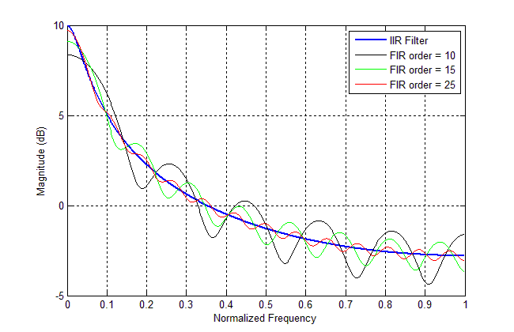</p>
<p align="center"> Figura 1. Diferencia fILTRO FIR VS IRR</p>
## Tabla de contenidos
- [Objetivos](#objetivos)
- [Materiales](#materiales)
- [Introducción](#introduccion)
- [Metolodogía](#metodología)
- [Resultados](#resultados)
- [Discusión de resultados](#Explicación/-Discusión-de-resultados)
- [Referencias](#referencias)
  
##  Objetivos
- Comprender los fundamentos de filtros digitales, especialmente los IRR y FIR
- Aplicar filtros IRR y FIR a señales de EMG, ECG y EEG.
- Analizar las señales tras aplicar los filtros.


<h2 align="center">Materiales</h2>

<div align="center">

| Material | Cantidad |
|:--------------:|:--------------:|
| Programa *Python* | N.A |

</div>

<h2 align="center">Materiales</h2>

<div align="center">

| Material | Cantidad | Imagen |
|:--------------:|:--------------:|:--------------:|
| Programa *Python* | N.A |  |

</div>

## Introducción

<div style="text-align: justify;">

### iltros digitales
Actualmente, los filtros digitales ofrecen una mayor flexibilidad frente a sus equivalentes analógicos, principalmente porque se implementan mediante software en lugar de hardware, lo que permite adaptar sus parámetros con facilidad en tiempo real. Esto es especialmente útil en aplicaciones donde las condiciones de operación varían constantemente. A diferencia de los filtros analógicos, los digitales no están condicionados por las tolerancias de los componentes electrónicos, eliminando la necesidad de ajustes físicos para su calibración. Como resultado, el comportamiento de los algoritmos digitales es altamente predecible y repetible. Además, los filtros digitales permiten trabajar con señales de frecuencias extremadamente bajas, sin los inconvenientes que suelen presentar los sistemas analógicos en este rango.

En aplicaciones biomédicas como el electromiograma (EMG), electrocardiograma (ECG) y electroencefalograma (EEG), se han desarrollado estrategias para eliminar interferencias de la red eléctrica y variaciones en el nivel de referencia de las señales. Estas estrategias emplean filtrado digital en tiempo real, favorecidas por la disponibilidad de microcontroladores y microprocesadores de bajo costo que facilitan la implementación eficiente de algoritmos de filtrado.

Dentro del procesamiento digital de señales, los filtros más comúnmente utilizados son los FIR (Finite Impulse Response) y los IIR (Infinite Impulse Response). Ambos se diferencian no solo en su estructura matemática, sino también en sus métodos de diseño. Los filtros IIR se caracterizan por utilizar una combinación de ceros y polos en su función de transferencia, mientras que los FIR se construyen únicamente con ceros y se definen por un polinomio en términos de la variable z, lo que les confiere propiedades de estabilidad y linealidad en fase útiles en diversas aplicaciones.

### Filtros IIR
El enfoque más utilizado para diseñar filtros IIR es la transformación bilineal, que adapta filtros analógicos clásicos, como el Butterworth, al dominio digital. Esta técnica permite aprovechar expresiones analíticas establecidas para obtener funciones de transferencia estables. Sin embargo, una de sus limitaciones radica en que, en muchos casos, el número de ceros y polos es igual, lo que puede restringir el rendimiento del filtro en ciertos escenarios. En algunos diseños, es preferible contar con más ceros que polos para obtener un mejor compromiso entre precisión y eficiencia computacional.

El filtro pasabajos de Butterworth sigue siendo una elección popular en el análisis de señales biomecánicas debido a su respuesta uniforme en la banda de paso y su capacidad para suavizar señales con transiciones suaves. No obstante, su naturaleza subamortiguada puede inducir errores durante cambios rápidos en la señal, lo que implica que podría sobreestimar o subestimar los valores reales en dichos eventos.

### Filtros FIR
Los filtros FIR destacan por su estabilidad inherente y por no requerir retroalimentación, ya que su salida depende únicamente de las entradas actuales y pasadas, pero no de salidas anteriores. No obstante, esta característica también los hace más complejos desde el punto de vista computacional, ya que requieren un mayor número de coeficientes y operaciones para replicar una respuesta deseada. A diferencia de los IIR, los FIR no tienen una metodología de diseño directa basada en el dominio del tiempo continuo, por lo que su construcción suele implicar métodos numéricos como la ventana de Hamming, algoritmos iterativos de optimización, o técnicas como Parks-McClellan.

El objetivo en su diseño es aproximar lo mejor posible una respuesta en frecuencia deseada, minimizando el error entre la respuesta ideal y la implementada con un número limitado de coeficientes. Este enfoque los convierte en una herramienta poderosa en contextos donde se requiere una respuesta de fase lineal y una gran precisión, a costa de una mayor demanda computacional.

## Metodología


### Diseño del Filtro para Señales EMG
Para el tratamiento de señales electromiográficas, se optó por un filtro digital IIR del tipo Butterworth, debido a su amplio uso en el procesamiento de señales biológicas y su eficacia demostrada en la supresión de ruidos de alta y baja frecuencia. El diseño seleccionado replica las características utilizadas en estudios previos exitosos, incluyendo un filtro pasa altas de segundo orden con una frecuencia de corte de 10 Hz, un filtro pasa bajas de octavo orden con una frecuencia de corte de 400 Hz, y una serie de seis filtros notch o rechaza banda de segundo orden para eliminar la interferencia de 60 Hz y sus armónicos hasta los 360 Hz.

Adicionalmente, se incorporó un filtro FIR con ventana de tipo Hamming y una frecuencia de corte de 30 Hz, cuyo objetivo es mitigar la contaminación generada por la actividad eléctrica cardíaca. Esta configuración ha sido recomendada en investigaciones que analizan la superposición del ECG en la señal EMG, particularmente en estudios donde se requiere un alto grado de limpieza para fines de análisis biomecánico o clínico.

### Diseño del Filtro para Señales ECG
En el caso de las señales electrocardiográficas, se realizó una evaluación comparativa de filtros IIR, incluyendo los de tipo Butterworth y Chebyshev. Los resultados más consistentes en cuanto a supresión de ruido y preservación de la señal se obtuvieron mediante un filtro Butterworth pasa bajas de octavo orden, con una frecuencia de corte de 60 Hz. Este tipo de filtro ha demostrado generar una alta relación señal-ruido (SNR), lo que asegura una adecuada conservación de las características morfológicas del ECG. Por tanto, esta configuración fue seleccionada para el diseño del filtro IIR, dado su balance entre atenuación de interferencias y fidelidad de la señal cardíaca.

### Diseño del Filtro para Señales EEG
Las señales electroencefalográficas suelen verse afectadas por artefactos generados por movimientos musculares, como los producidos al hablar, parpadear o mover los ojos. Estos artefactos tienden a contaminar la banda de interés neurológica, dificultando el análisis de patrones cerebrales. Para minimizar este tipo de interferencia, se implementó un filtro Butterworth pasa bajas de octavo orden con una frecuencia de corte de 35 Hz. Esta elección permite preservar las componentes útiles del EEG, especialmente en bandas como alfa y beta, mientras se eliminan frecuencias más altas típicamente asociadas a actividad muscular.
## Resultados


### EMG

Los resultados analizados en la siguiente tabla se obtuvieron al realizar el EMG del bíceps. 
Los electrodos fueron colocados como se observa en la figura 1. Los electrodos positivo y negativo será colocados en el músculo de interés, en este caso el bíceps mientras que el electrodo de referencia será colocado en una zona neutra como la muñeca.
Se tomó registro de la señal en el usuario en estado de reposo o silencio eléctrico y realizando la contracción muscular.


<p align="center">
  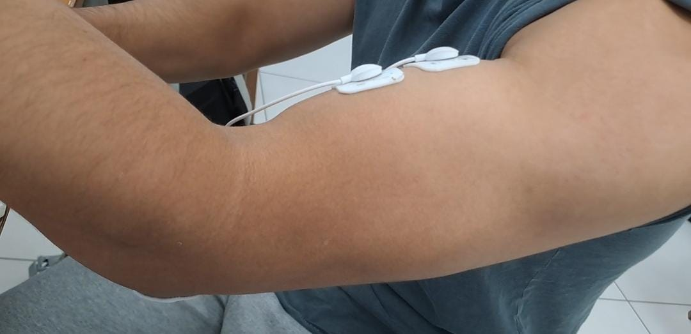
</p>
<p align="center"><b>Figura 1:</b> Posicionamiento de los electrodos</p>

| Campo | Señal Cruda | Filtro IRR | Filtro FIR |
|:--------------:|:--------------:|:--------------:|:--------------:|
| Figura 2. Descanso| |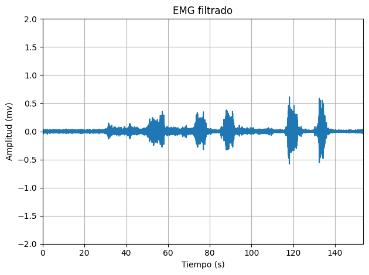|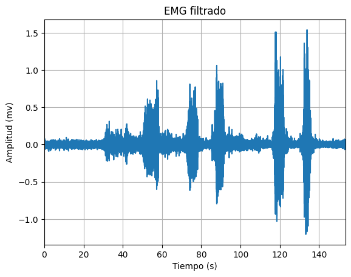|
| Figura 3. Contracción leve | 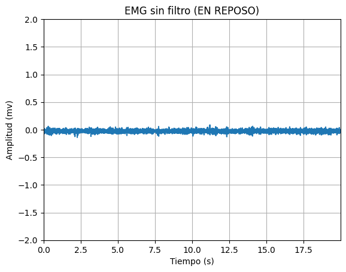| 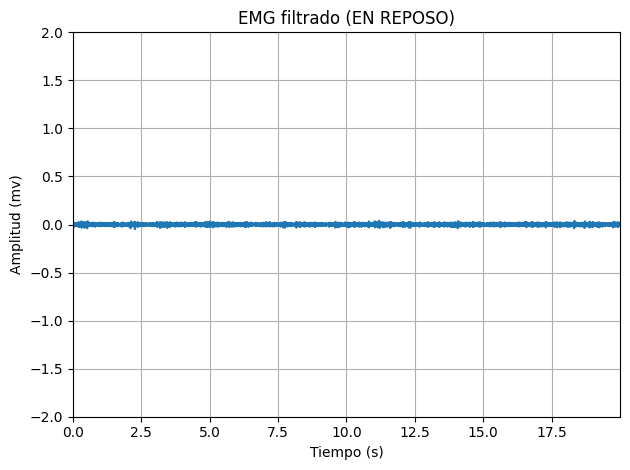| 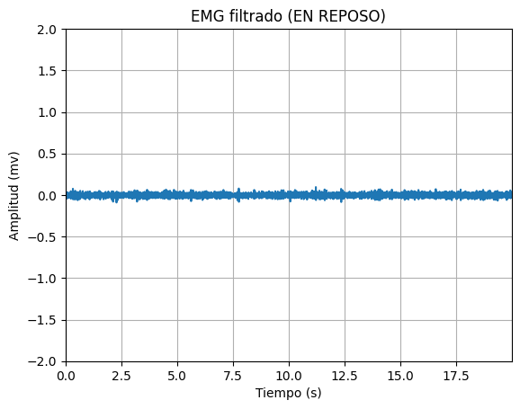|
| Figura 4. Contracción fuerte | 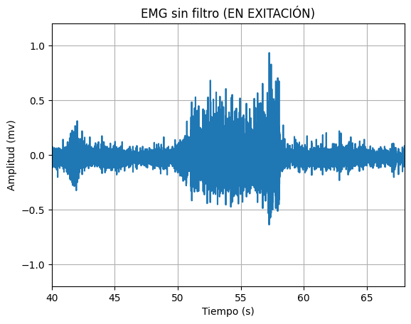| 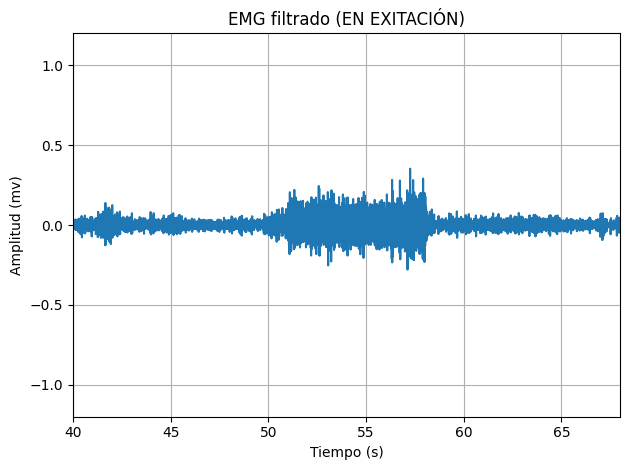| 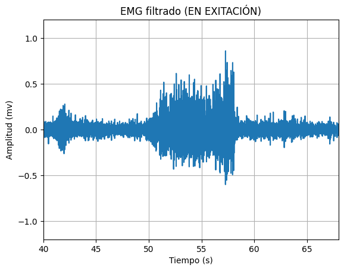|

### ECG

Los resultados analizados en la siguiente tabla se obtuvieron al realizar el ECG. 
Los electrodos fueron colocados como se observa en la figura 2. El electrodo positivo se posicionó en la clavícula izquierda, electrodo negativo en la clavícula derecha y electrodo de referencia en la cresta iliaca. 
Se tomó registro de la señal en el usuario en estado de reposo, hiperventilación, después de hacer ejercicio y al realizar respiraciones largas.


<p align="center">
  
</p>
<p align="center"><b>Figura 5:</b> [Descripción de la imagen]</p>


| Campo | Señal Cruda | Filtro IRR | Filtro FIR |
|:--------------:|:--------------:|:--------------:|:--------------:|
| Figura 6. Estado Basal | 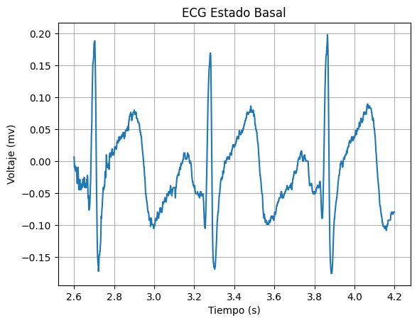| 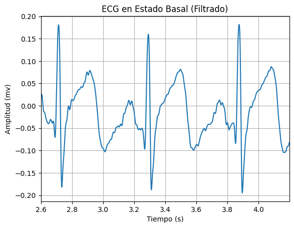 | 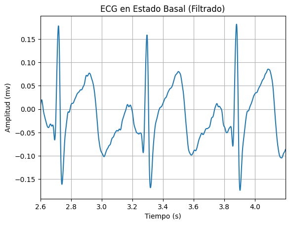 |
| Figura 7. Respiración controlada |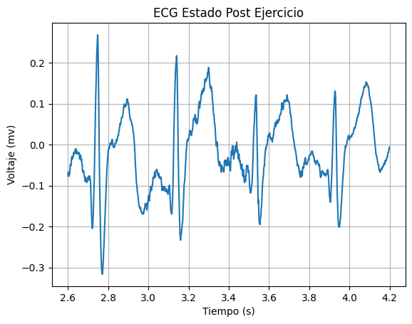| 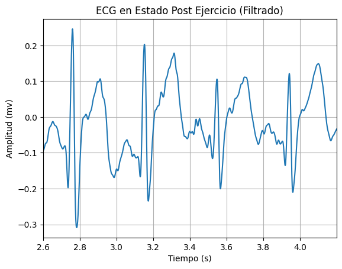| 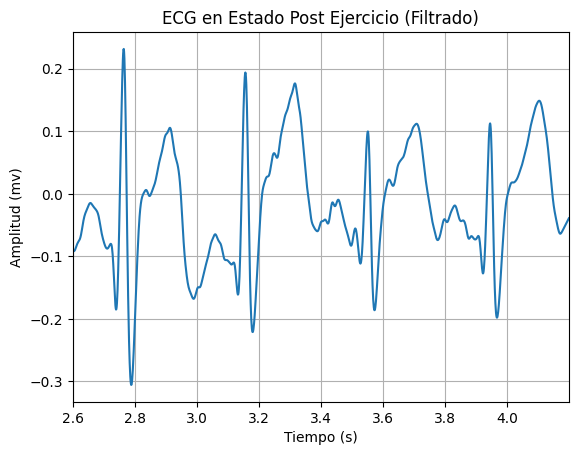 |
| Figura 8. Ejercicio intenso| 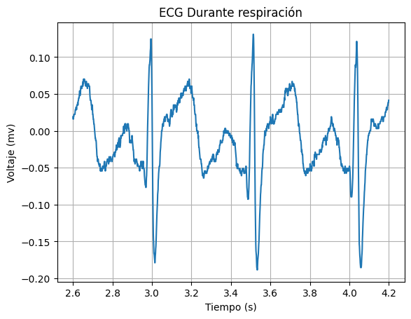| 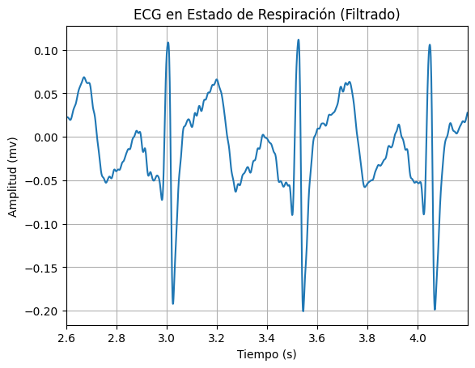| 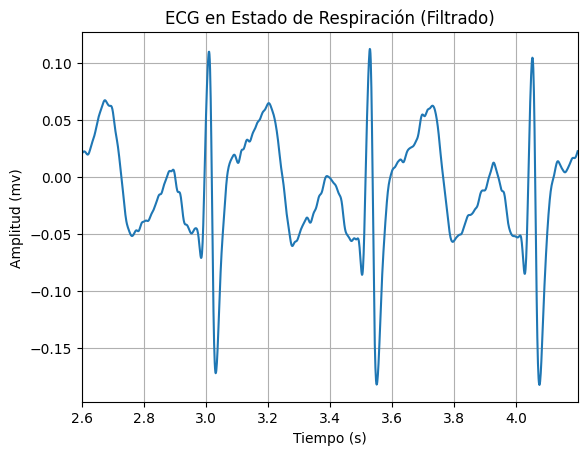|
| Figura 8. Respiración prolongada | | | |
### EEG

Los resultados analizados en la siguiente tabla se obtuvieron al realizar el EEG. 
Los electrodos fueron colocados como se observa en la figura 3 de acuerdo a la configuración del sistema internacional 10-20.
Se tomó registro de la señal en el usuario en una primera y segunda fase de referencia, en ciclos de ojos cerrados y abierto y realizando ejercicios mentales simples y complejos.


<p align="center">
  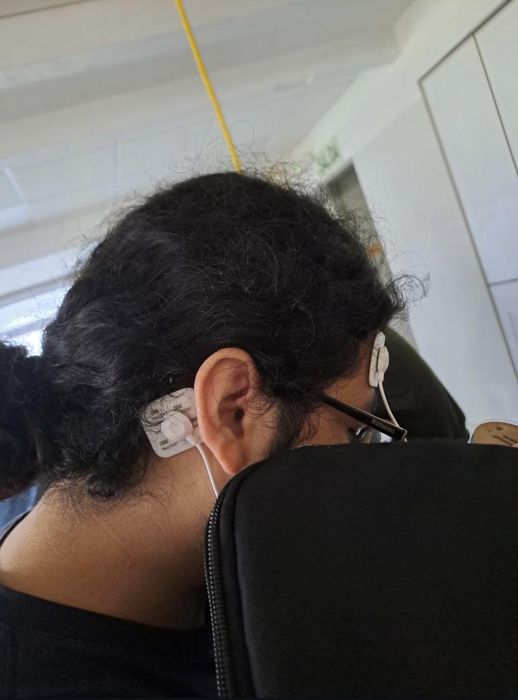
</p>
<p align="center"><b>Figura X:</b> [Descripción de la imagen]</p>


| Campo| Señal Cruda | Filtro IRR | Filtro FIR |
|:--------------:|:--------------:|:--------------:|:--------------:|
| Figura X. Basal 1 (60 segundos) | | 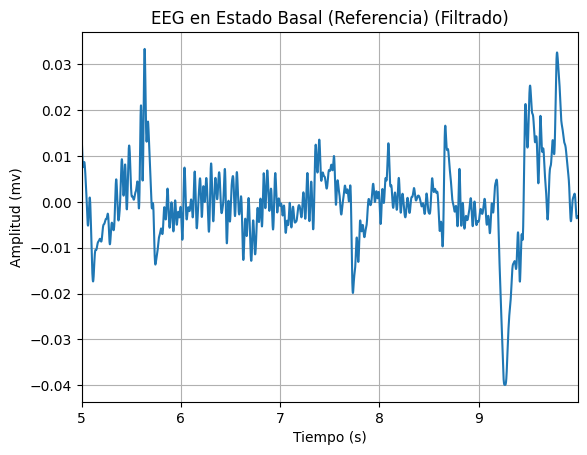 | 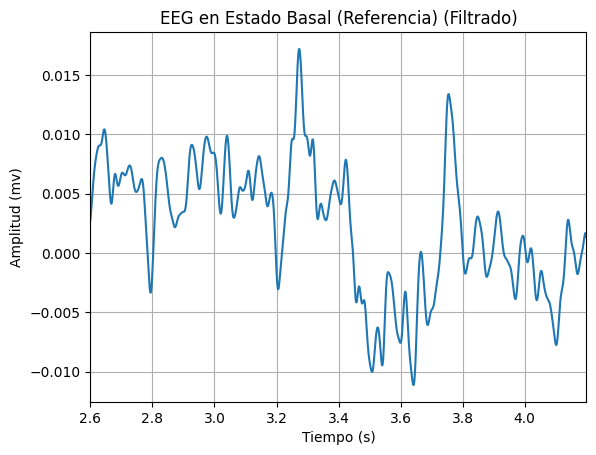 |
| Figura X. Basal 2 (60 segundos) | |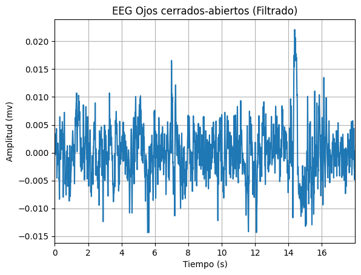|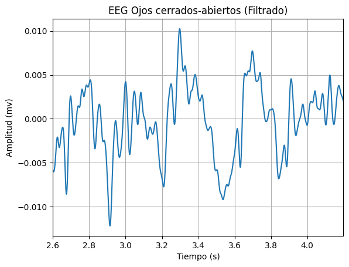|
| Figura X. Tarea cognitiva (2 minutos) | 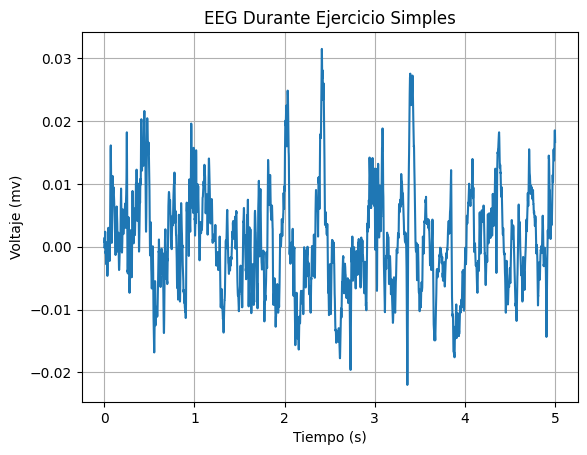| 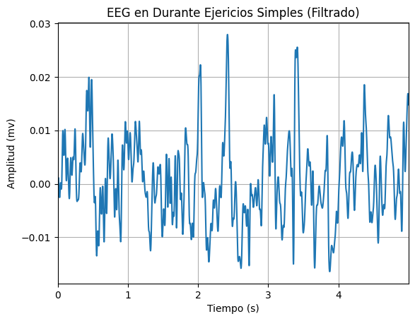|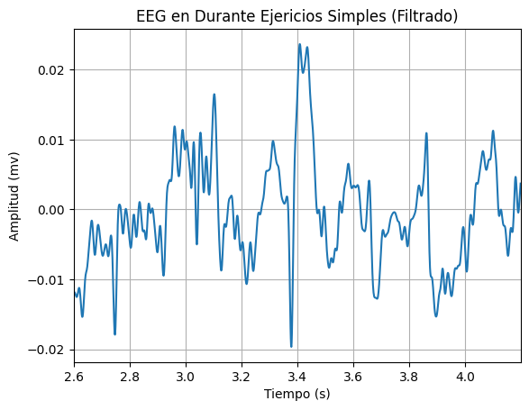 |
| Figura X. Artefactos (2 minutos) |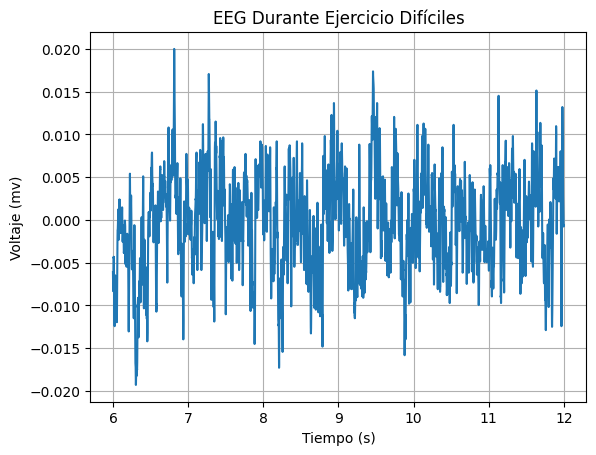| 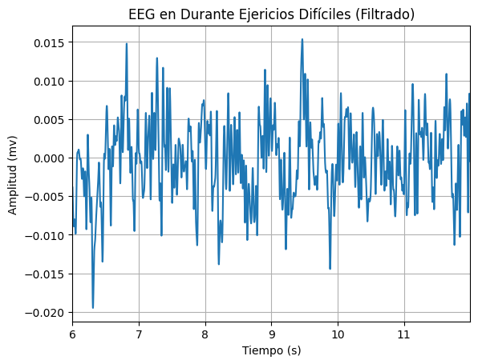 |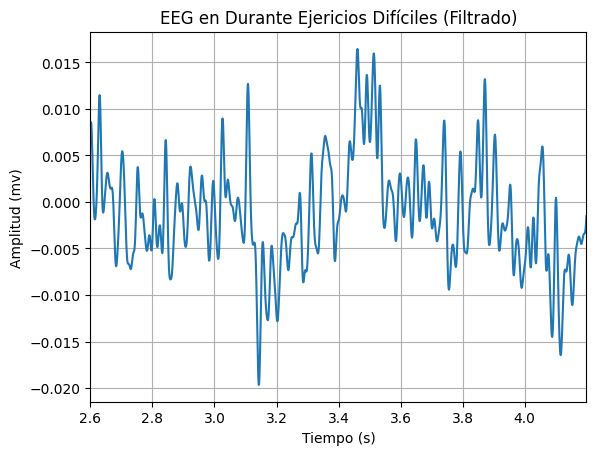|
| Figura X. Preguntas complejas (6 minutos) ||  ||


## Código en Python

``` python
import pandas as pd
import matplotlib.pyplot as plt
import numpy as np
from scipy import signal

def get_values(path, col):
  df = pd.read_csv(path, sep='\t', skiprows=3)  # saltar las dos primeras filas (encabezado)
  novena_columna = df.iloc[:, col].values
  n = [i/1000 for i in range(0, len(novena_columna))]
  signal = [(float(valor)/(2**10)-1/2)*3.3/1009*1000 for valor in novena_columna]
  return n, signal

def get_valuesEEG(path, col):
  df = pd.read_csv(path, sep='\t', skiprows=3)  # saltar las dos primeras filas (encabezado)
  novena_columna = df.iloc[:, col].values
  n = [i/1000 for i in range(0, len(novena_columna))]
  signal = [(float(valor)/(2**10)-1/2)*3.3/41782*1000 for valor in novena_columna]
  return n, signal

def plot_values(n, y, label, ini, fin):
  plt.plot(n[ini:fin], y[ini:fin])
  plt.xlabel('Tiempo (s)')
  plt.ylabel('Voltaje (mv)')
  plt.title(label)
  plt.grid(True)
  plt.show()

def FreqAnalysis (signal):
  fs = 1000
  fft_result = np.fft.fft(signal)
  freqs = np.fft.fftfreq(len(signal), 1/fs)
  plt.figure(figsize=(10, 5))
  plt.plot(freqs, np.abs(fft_result))
  plt.xlim(-50, 50)
  plt.title('Magnitud de la Transformada Rápida de Fourier (FFT)')
  plt.xlabel('Frecuencia (Hz)')
  plt.ylabel('Magnitud')
  plt.grid(True)
  plt.show()

```
### Importación de Señales

``` python

# Señales EMG

path = "/content/drive/MyDrive/PUCP/7mo ciclo/Instruducción a Señales Biomédicas/Laboratorios/EMG/BICEPS.txt"
[n, EMGsignal] = get_values(path, 5)
label = "EMG de los bíceps"


# Señales ECG

path = "/content/drive/MyDrive/PUCP/7mo ciclo/Instruducción a Señales Biomédicas/Laboratorios/ECG/J1.txt"
[n, ECGsignal1] = get_values(path, 6)
label = "ECG Estado Basal"


path = "/content/drive/MyDrive/PUCP/7mo ciclo/Instruducción a Señales Biomédicas/Laboratorios/ECG/POS EJERCICIO.txt"
[n, ECGsignal2] = get_values(path, 6)
label = "ECG Estado Post Ejercicio"


path = "/content/drive/MyDrive/PUCP/7mo ciclo/Instruducción a Señales Biomédicas/Laboratorios/ECG/RESPIRACION.txt"
[n, ECGsignal3] = get_values(path, 6)
label = "ECG Durante respiración"


# Señales EEG

path = "/content/drive/MyDrive/PUCP/7mo ciclo/Instruducción a Señales Biomédicas/Laboratorios/EEG/dificil.txt"
[n, EEGsignal] = get_valuesEEG(path, 8)
label = "EEG Durante Ejercicio Difíciles"

# Señales ECG

path = "/content/drive/MyDrive/PUCP/7mo ciclo/Instruducción a Señales Biomédicas/Laboratorios/EEG/dificil.txt"
[n, EEGsignal1] = get_valuesEEG(path, 8)
label = "EEG Durante Ejercicio Difíciles"

path = "/content/drive/MyDrive/PUCP/7mo ciclo/Instruducción a Señales Biomédicas/Laboratorios/EEG/paso1.txt"
[n, EEGsignal3] = get_valuesEEG(path, 8)
label = "EEG Estado Basal (Referencia)"

path = "/content/drive/MyDrive/PUCP/7mo ciclo/Instruducción a Señales Biomédicas/Laboratorios/EEG/simples.txt"
[n, EEGsignal2] = get_valuesEEG(path, 8)
label = "EEG Durante Ejercicio Simples"
plot_values(n, EEGsignal2, label, 0, 5000)

path = "/content/drive/MyDrive/PUCP/7mo ciclo/Instruducción a Señales Biomédicas/Laboratorios/EEG/paso2.txt"
[n, EEGsignal3] = get_valuesEEG(path, 8)
label = "EEG Ojos cerrados-abiertos"

```

### Filtrados IIR para las Señales EMG

``` python
b,a = signal.butter(2, 10, 'highpass', fs=1000, output='ba')
filteredEMG =signal.filtfilt(b,a, EMGsignal)
b,a = signal.butter(8, 400, 'lowpass', fs=1000, output='ba')
filteredEMG =signal.filtfilt(b,a, filteredEMG)
b,a = signal.butter(2, [40, 80], 'stop', fs=1000, output='ba')
filteredEMG =signal.filtfilt(b,a, filteredEMG)
b,a = signal.butter(2, [100, 140], 'stop', fs=1000, output='ba')
filteredEMG =signal.filtfilt(b,a, filteredEMG)
b,a = signal.butter(2, [160, 200], 'stop', fs=1000, output='ba')
filteredEMG =signal.filtfilt(b,a, filteredEMG)
b,a = signal.butter(2, [220, 260], 'stop', fs=1000, output='ba')
filteredEMG =signal.filtfilt(b,a, filteredEMG)
b,a = signal.butter(2, [280, 320], 'stop', fs=1000, output='ba')
filteredEMG =signal.filtfilt(b,a, filteredEMG)
b,a = signal.butter(2, [340, 380], 'stop', fs=1000, output='ba')
filteredEMG =signal.filtfilt(b,a, filteredEMG)

plt.figure()
n = [i/1000 for i in range(0,len(EMGsignal))]
plt.plot(n, EMGsignal)
plt.ylabel("Amplitud (mv)")
plt.xlabel("Tiempo (s)")
plt.title("EMG sin filtro")
plt.grid(True)
plt.margins(0, 0.05)

plt.figure()
plt.plot(n, filteredEMG)
plt.ylabel("Amplitud (mv)")
plt.xlabel("Tiempo (s)")
plt.title("EMG filtrado")
plt.grid(True)
plt.margins(0, 0.05)
plt.tight_layout()
plt.show()

plt.figure()
n = [i/1000 for i in range(0,len(EMGsignal))]
plt.plot(n[0:20000], EMGsignal[0:20000])
plt.ylabel("Amplitud (mv)")
plt.xlabel("Tiempo (s)")
plt.title("EMG sin filtro (EN REPOSO)")
plt.grid(True)
plt.ylim([-2, 2])
plt.margins(0, 0.05)

plt.figure()
plt.plot(n[0:20000], filteredEMG[0:20000])
plt.ylabel("Amplitud (mv)")
plt.xlabel("Tiempo (s)")
plt.title("EMG filtrado (EN REPOSO)")
plt.ylim([-2, 2])
plt.grid(True)
plt.margins(0, 0.05)
plt.tight_layout()
plt.show()

plt.figure()
n = [i/1000 for i in range(0,len(EMGsignal))]
plt.plot(n[40000:68000], EMGsignal[40000:68000])
plt.ylabel("Amplitud (mv)")
plt.xlabel("Tiempo (s)")
plt.title("EMG sin filtro (EN EXITACIÓN)")
plt.ylim([-1.2, 1.2])
plt.grid(True)
plt.margins(0, 0.05)

plt.figure()
plt.plot(n[40000:68000], filteredEMG[40000:68000])
plt.ylabel("Amplitud (mv)")
plt.xlabel("Tiempo (s)")
plt.title("EMG filtrado (EN EXITACIÓN)")
plt.ylim([-1.2, 1.2])
plt.margins(0, 0.05)
plt.grid(True)
plt.tight_layout()
plt.show()

```

### Filtrado FIR para las señales EMG

``` python

t = [num / fs for num in n]; N=len(n)
M = 37;
Fc = 30
wc = 2*np.pi*Fc/fs
w = firwin(numtaps=M, cutoff=Fc, window='hamming', fs=1000, pass_zero=False)
w = np.round(w,3)
nm = np.arange(M)
W = np.fft.fft(w,N)
W = np.round(W[0:N//2],3)
y_filtrado = lfilter(w, np.array(1),EMGsignal)
plt.figure()
n = [i/1000 for i in range(0,len(EMGsignal))]
plt.plot(n[0: 20000], y_filtrado[0: 68000])
plt.ylabel("Amplitud (mv)")
plt.xlabel("Tiempo (s)")
plt.ylim([-2, 2])
plt.title("EMG filtrado (EN REPOSO)")
plt.grid(True)
plt.margins(0, 0.05)

fs=1000 #Frecuencia de muestreo
t = [num / fs for num in n]; N=len(n)
M = 37;
Fc = 30
wc = 2*np.pi*Fc/fs
w = firwin(numtaps=M, cutoff=Fc, window='hamming', fs=1000, pass_zero=False)
w = np.round(w,3)
nm = np.arange(M)
W = np.fft.fft(w,N)
W = np.round(W[0:N//2],3)
y_filtrado = lfilter(w, np.array(1),EMGsignal)
plt.figure()
n = [i/1000 for i in range(0,len(EMGsignal))]
plt.plot(n[40000: 68000], y_filtrado[40000: 68000])
plt.ylabel("Amplitud (mv)")
plt.xlabel("Tiempo (s)")
plt.ylim([-1.2, 1.2])
plt.title("EMG filtrado (EN EXITACIÓN)")
plt.grid(True)
plt.margins(0, 0.05)

```
 
### Filtrado IIR para las señales ECG 

``` python

b = [6.622623141047573e-07,5.2980985128380585e-06,1.8543344794933204e-05,3.7086689589866414e-05,4.635836198733302e-05,3.708668958986641e-05,1.8543344794933207e-05,5.2980985128380585e-06,6.622623141047573e-07]
a = [1.0,-6.068790722024154,16.298664203810503,-25.26779226940654,24.70705645741085,-15.590167548706336,6.195189257371583,-1.4166345584748548,0.14264471917136207]

filteredECG = signal.lfilter(b,a,ECGsignal1)

plt.figure()
n = [i/1000 for i in range(0,len(filteredECG))]
plt.plot(n[2600: 4200], filteredECG[2600: 4200])
plt.ylabel("Amplitud (mv)")
plt.xlabel("Tiempo (s)")
plt.title("ECG en Estado Basal (Filtrado)")
plt.grid(True)
plt.margins(0, 0.05)

filteredECG = signal.lfilter(b,a,ECGsignal2)

plt.figure()
n = [i/1000 for i in range(0,len(filteredECG))]
plt.plot(n[2600: 4200], filteredECG[2600: 4200])
plt.ylabel("Amplitud (mv)")
plt.xlabel("Tiempo (s)")
plt.title("ECG en Estado Post Ejercicio (Filtrado)")
plt.grid(True)
plt.margins(0, 0.05)

filteredECG = signal.lfilter(b,a,ECGsignal3)
plt.figure()
n = [i/1000 for i in range(0,len(filteredECG))]
plt.plot(n[2600: 4200], filteredECG[2600: 4200])
plt.ylabel("Amplitud (mv)")
plt.xlabel("Tiempo (s)")
plt.title("ECG en Estado de Respiración (Filtrado)")
plt.grid(True)
plt.margins(0, 0.05)
```

### Filtrado FIR para las señales ECG 

``` python

fs=1000 #Frecuencia de muestreo
t = [num / fs for num in n]; N=len(n)
M = 37
Fc = 50
wc = 2*np.pi*Fc/fs
# filtro fir
w = firwin(numtaps=M, cutoff=Fc, window='hamming', fs=1000)
w = np.round(w,3)
nm = np.arange(M)
W = np.fft.fft(w,N)
W = np.round(W[0:N//2],3)
y_filtrado = lfilter(w, np.array(1),ECGsignal2)
plt.figure()
n = [i/1000 for i in range(0,len(filteredECG))]
plt.plot(n[2600: 4200], y_filtrado[2600: 4200])
plt.ylabel("Amplitud (mv)")
plt.xlabel("Tiempo (s)")
plt.title("ECG en Estado Basal (Filtrado)")
plt.grid(True)
plt.margins(0, 0.05)

fs=1000 #Frecuencia de muestreo
t = [num / fs for num in n]; N=len(n)
M = 37
Fc = 50
wc = 2*np.pi*Fc/fs
# filtro fir
w = firwin(numtaps=M, cutoff=Fc, window='hamming', fs=1000)
w = np.round(w,3)
nm = np.arange(M)
W = np.fft.fft(w,N)
W = np.round(W[0:N//2],3)
y_filtrado = lfilter(w, np.array(1),ECGsignal2)
plt.figure()
n = [i/1000 for i in range(0,len(filteredECG))]
plt.plot(n[2600: 4200], y_filtrado[2600: 4200])
plt.ylabel("Amplitud (mv)")
plt.xlabel("Tiempo (s)")
plt.title("ECG en Estado Basal (Filtrado)")
plt.grid(True)
plt.margins(0, 0.05)

fs=1000 #Frecuencia de muestreo
t = [num / fs for num in n]; N=len(n)
M = 37
Fc = 50
wc = 2*np.pi*Fc/fs
# filtro fir
w = firwin(numtaps=M, cutoff=Fc, window='hamming', fs=1000)
w = np.round(w,3)
nm = np.arange(M)
W = np.fft.fft(w,N)
W = np.round(W[0:N//2],3)
y_filtrado = lfilter(w, np.array(1),ECGsignal3)
plt.figure()
n = [i/1000 for i in range(0,len(filteredECG))]
plt.plot(n[2600: 4200], y_filtrado[2600: 4200])
plt.ylabel("Amplitud (mv)")
plt.xlabel("Tiempo (s)")
plt.title("ECG en Estado Basal (Filtrado)")
plt.grid(True)
plt.margins(0, 0.05)

```

### Filtrado IIR para las señales EEG

``` python
b,a = signal.butter(8, 35, 'lowpass', fs=1000, output='ba')
filteredEEG =signal.filtfilt(b,a, EEGsignal2)
plt.figure()
n = [i/1000 for i in range(0,len(filteredEEG))]
plt.plot(n[5000:10000], filteredEEG[5000:10000])
plt.ylabel("Amplitud (mv)")
plt.xlabel("Tiempo (s)")
plt.title("EEG en Estado Basal (Referencia) (Filtrado)")
plt.grid(True)
plt.margins(0, 0.05)

b,a = signal.butter(8, 35, 'lowpass', fs=1000, output='ba')
filteredEEG =signal.filtfilt(b,a, EEGsignal2)
plt.figure()
n = [i/1000 for i in range(0,len(filteredEEG))]
plt.plot(n[0:5000], filteredEEG[0:5000])
plt.ylabel("Amplitud (mv)")
plt.xlabel("Tiempo (s)")
plt.title("EEG en Durante Ejericios Simples (Filtrado)")
plt.grid(True)
plt.margins(0, 0.05)

b,a = signal.butter(8, 35, 'lowpass', fs=1000, output='ba')
filteredEEG =signal.filtfilt(b,a, EEGsignal1)
plt.figure()
n = [i/1000 for i in range(0,len(filteredEEG))]
plt.plot(n[6000:12000], filteredEEG[6000:12000])
plt.ylabel("Amplitud (mv)")
plt.xlabel("Tiempo (s)")
plt.title("EEG en Durante Ejericios Difíciles (Filtrado)")
plt.grid(True)
plt.margins(0, 0.05)

b,a = signal.butter(8, 35, 'lowpass', fs=1000, output='ba')
filteredEEG =signal.filtfilt(b,a, EEGsignal2)
plt.figure()
n = [i/1000 for i in range(0,len(filteredEEG))]
plt.plot(n[0:18000], filteredEEG[0:18000])
plt.ylabel("Amplitud (mv)")
plt.xlabel("Tiempo (s)")
plt.title("EEG Ojos cerrados-abiertos (Filtrado)")
plt.grid(True)
plt.margins(0, 0.05)
```

### Filtrado FIR para las señales EEG

``` python

fs=1000 #Frecuencia de muestreo
t = [num / fs for num in n]; N=len(n)
M = 37;
Fc = 50
wc = 2*np.pi*Fc/fs
w = firwin(numtaps=M, cutoff=[8,12], window='blackman', fs=1000,pass_zero=False)
w = np.round(w,3)
nm = np.arange(M)
W = np.fft.fft(w,N)
W = np.round(W[0:N//2],3)
y_filtrado = lfilter(w, np.array(1),EEGsignal3)

plt.figure()
n = [i/1000 for i in range(0,len(y_filtrado))]
plt.plot(n[2600: 4200], y_filtrado[2600: 4200])
plt.ylabel("Amplitud (mv)")
plt.xlabel("Tiempo (s)")
plt.title("EEG en Estado Basal (Referencia) (Filtrado)")
plt.grid(True)
plt.margins(0, 0.05)

fs=1000 #Frecuencia de muestreo
t = [num / fs for num in n]; N=len(n)
M = 37;
Fc = 50
wc = 2*np.pi*Fc/fs
w = firwin(numtaps=M, cutoff=[30,40], window='blackman', fs=1000, pass_zero=False)
w = np.round(w,3)
nm = np.arange(M)
W = np.fft.fft(w,N)
W = np.round(W[0:N//2],3)
y_filtrado = lfilter(w, np.array(1),EEGsignal2)

plt.figure()
n = [i/1000 for i in range(0,len(y_filtrado))]
plt.plot(n[2600: 4200], y_filtrado[2600: 4200])
plt.ylabel("Amplitud (mv)")
plt.xlabel("Tiempo (s)")
plt.title("EEG en Durante Ejericios Simples (Filtrado)")
plt.grid(True)
plt.margins(0, 0.05)

fs=1000 #Frecuencia de muestreo
t = [num / fs for num in n]; N=len(n)
M = 37;
Fc = 50
wc = 2*np.pi*Fc/fs
w = firwin(numtaps=M, cutoff=[30,40], window='blackman', fs=1000, pass_zero=False)
w = np.round(w,3)
nm = np.arange(M)
W = np.fft.fft(w,N)
W = np.round(W[0:N//2],3)
y_filtrado = lfilter(w, np.array(1),EEGsignal1)

plt.figure()
n = [i/1000 for i in range(0,len(y_filtrado))]
plt.plot(n[2600: 4200], y_filtrado[2600: 4200])
plt.ylabel("Amplitud (mv)")
plt.xlabel("Tiempo (s)")
plt.title("EEG en Durante Ejericios Difíciles (Filtrado)")
plt.grid(True)
plt.margins(0, 0.05)

fs=1000 #Frecuencia de muestreo
t = [num / fs for num in n]; N=len(n)
M = 37;
Fc = 50
wc = 2*np.pi*Fc/fs
w = firwin(numtaps=M, cutoff=[8,12], window='blackman', fs=1000,pass_zero=False)
w = np.round(w,3)
nm = np.arange(M)
W = np.fft.fft(w,N)
W = np.round(W[0:N//2],3)
y_filtrado = lfilter(w, np.array(1),EEGsignal4)

plt.figure()
n = [i/1000 for i in range(0,len(y_filtrado))]
plt.plot(n[2600: 4200], y_filtrado[2600: 4200])
plt.ylabel("Amplitud (mv)")
plt.xlabel("Tiempo (s)")
plt.title("EEG Ojos cerrados-abiertos (Filtrado)")
plt.grid(True)
plt.margins(0, 0.05)
```

## Discusión de resultados

### EMG

Debido a que la electromiografía de superficie es una técnica no invasiva es susceptible a una mayor cantidad de interferencias como la interferencia de la red eléctrica especialmente cuando la amplitud de la señal es baja [1, 6]. Esto es común debido a que la señal EMG en este tipo de técnicas presentan actividad mioeléctrica con una magnitud muy baja que pueden reducir la relación entre dicha señal y el ruido [6]. 

En primer lugar observamos la señal cruda la cual es ruidosa lo cual puede debido a los tipos de interferencia mencionados [1]. En comparación a esta primera gráfica los resultados de los filtros IIR y FIR aplicados a las señales de EMG tienen diferencias significativas ya que atenúan la señal y filtran dichas interferencias [1].

El filtro IIR Butterworth diseñado cuenta en primer lugar con un filtro pasa alto con una frecuencia de corte de 10 Hz para eliminar componentes de baja frecuencia no deseadas, seguido de un filtro pasa bajo con una frecuencia de corte de 400 Hz para eliminar componentes de alta frecuencia y por último seis filtros pasa banda [6]. La señal filtrada en comparación con la señal sin filtrar tiene una reducción significativa en el ruido de alta y baja frecuencia, así como la eliminación de bandas de interferencia específicas. Esto se puede comparar con un estudio de Mella, Oliviero y Nadal de 2007 en el que también se logró filtrar eficientemente una señal EMG [6].

Por otro lado, el filtro FIR diseño cuenta con un filtro pasa banda con una frecuencia central de 30 Hz para filtrar la señal EMG. La señal filtrada en comparación con la señal sin filtrar también muestra una reducción significativa en el ruido de alta y baja frecuencia. 

Por ende, al observar los resultados de ambos filtros aplicados a las señales de EMG se muestra una reducción del ruido en ambas condiciones, tanto en reposo como durante la excitación. Sin embargo, es importante destacar que el filtro FIR conserva en un mayor grado la forma de onda original de la señal EMG, sin introducir distorsiones significativas en comparación con los filtros IIR [6].


### ECG

Debido a que el ECG es una señal de baja frecuencia puede ser fácilmente influenciada por la corriente eléctrica suministrada por la red eléctrica así como interferencia por cambios en el nivel de referencia de una señal como la respiración del usuario u otros movimientos realizando durante la toma de datos  [1]. Por ende, el filtrado se utiliza para eliminar los componentes de frecuencia no deseados mientras se preserva la originalidad de la señal [9].

En primer lugar observamos la señal cruda la cual es ruidosa lo cual puede debido a los tipos de interferencia mencionados [1]. En comparación a esta primera gráfica los resultados de los filtros IIR y FIR aplicados a las señales de ECG tienen diferencias significativas ya que atenúan la señal y filtran dichas interferencias [1].

En el filtro IIR los coeficientes 'b' y 'a' del numerador y denominador de la función de transferencia se utilizan para aplicar el filtro a la señal de ECG [1]. La naturaleza de la señal de salida tras aplicar el filtro depende en gran medida del orden del filtro, en este caso 8, el cual a su vez depende de dichos coeficientes establecidos [9]. Este tipo de filtro reduce los recursos que se necesitan computacionalmente y debido a que es pasabaja es útil para eliminar el ruido de alta frecuencia en las señales de ECG con una transición de banda eficiente [9]. Sin embargo, debido a su respuesta de fase no lineal, puede introducir distorsión en la señal, especialmente durante las transiciones rápidas [1]. Por lo tanto, la respuesta en magnitud del filtro de Butterworth disminuye monótonamente a medida que aumenta la frecuencia [1]. En comparación a las gráficas de ECG tras aplicar el filtro IRR Butterworth de un estudio comparativo realizado por Basu y Mamut en 2020 en el que se evaluaban diferentes órdenes del filtro y frecuencias de corte incluyendo las utilizadas en el código propuesto, la señal se logró filtrar exitosamente disminuyendo los efectos distorsión mencionados debido a que se utilizó un orden de filtro alto [9]. En conclusión, el filtrado IIR proporciona una suavización más agresiva de la señal, pero puede producir cierta distorsión. 

Por otro lado, en el filtro FIR se utiliza una ventana de Hamming para diseñar el filtro. Este tipo de filtro tiene una respuesta de fase lineal, lo que significa que no introduce distorsión en la señal [1]. Sin embargo puede requerir más recursos computacionales y puede no ser tan eficiente como el filtrado IIR [1]. Esto se debe a que a pesar de que se utilice un orden de filtro mayor para asegurar su rendimiento esto también implica retrasos de fase en la señal de salida filtrada [11]. Dicho retraso de fase se puede observar en las gráficas y también se puede comparar con las publicadas en un artículo de Saxena, Jais y Kumar en 2019 [11].

Al observar los resultados de ambos filtros aplicados a las señales de ECG, es probable que el filtrado IIR proporcione una suavización más agresiva de la señal, pero puede introducir cierta distorsión a pesar de utilizar un orden alto para la función de transferencia [9]. Por otro lado, el filtrado FIR puede proporcionar una suavización más suave con menos distorsión, pero puede requerir más recursos computacionales para asegurar su eficiencia [11]. 


### EEG

Las señales de EEG son señales de muy baja frecuencia que pueden ser contaminadas por ruido de señales internas del cuerpo como señales de EMG ante la actividad muscular y EOG, o señales extrañas provenientes del ambiente o los mismos electrodos [10]. Se observa que los gráficos obtenidos sin filtrar poseen mucho ruido, el cual se debió a la contaminación de la señal por movimientos oculares o faciales como parpadear o hablar.

Por otro lado, a partir de [12], se puede observar que los filtros FIR pueden ser mas efectivos que los IIR al momento de purificar las señales. Esto se puede apreciar claramente en los _ploteos_ mostrados; en ellos se observa que las señal procesada por los filtros FIR posee menos picos locales y menos artefactos.


## Referencias

1. Wang, Y., et al. (2021). Real-time digital filtering methods for biomedical signal processing: A review. Biomedical Signal Processing and Control, 68, 102643. https://doi.org/10.1016/j.bspc.2021.102643

2.Abdelghani, H., & Bayoumi, M. (2020). Modern digital filter design techniques and applications in biomedical systems. Springer.

3. Nallathambi, G., & Jafari, R. (2022). Embedded biomedical signal filtering using resource-optimized digital filter architectures. IEEE Transactions on Biomedical Circuits and Systems

4. Kaur, P., & Malhotra, S. (2023). Comparative analysis of FIR and IIR filters in EEG signal denoising. Journal of Biomedical Research

5. Yu, X., et al. (2021). Design and implementation of digital filters for EMG signal preprocessing in prosthetic control. Biomedical Signal Processing and Control

6. Mahmoud, M. A., & Mosa, A. H. (2022). Comparative performance analysis of ECG filtering techniques using IIR filters. IEEE Access

7. Han, C. H., et al. (2020). Efficient noise removal in EEG signals using adaptive filtering and frequency domain techniques. Sensors 

8.Zhao, Y., & Wang, S. (2023). Evaluation of FIR and IIR filters in biomedical signal denoising: A case study on EMG and EEG. Journal of Medical Systems

9. S. Basu y S. Mamud, “Comparative study on the effect of order and Cut off frequency of Butterworth Low Pass filter for removal of noise in ECG signal”, en 2020 IEEE 1st International Conference for Convergence in Engineering (ICCE), 2020, pp. 156–160.

10. P. V. Dutande, S. L. Nalbalwar, y S. V. Khobragade, “FPGA implementation of filters for removing muscle artefacts from EEG signals”, en 2018 Second International Conference on Intelligent Computing and Control Systems (ICICCS), 2018, pp. 728–732.

11. Saxena S, Jais R, Hota MK. Removal of Powerline Interference from ECG Signal using FIR, IIR, DWT and NLMS Adaptive Filter. En: 2019 International Conference on Communication and Signal Processing (ICCSP) [Internet]; 4-6 de abril de 2019; Chennai, India. [lugar desconocido]: IEEE; 2019 [consultado el 5 de mayo de 2024]. Disponible en: https://doi.org/10.1109/iccsp.2019.8698112 

12. Performance Analysis of IIR & FIR Windowing Techniques in Electroencephalography Signal Processing. VOL 8 ISSUE 10 AUGUST 2019 REGUL ISSUE [Internet]. 10 de agosto de 2019 [consultado el 5 de mayo de 2024];8(10):3568-78. Disponible en: https://doi.org/10.35940/ijitee.j9771.0881019 


</div>
