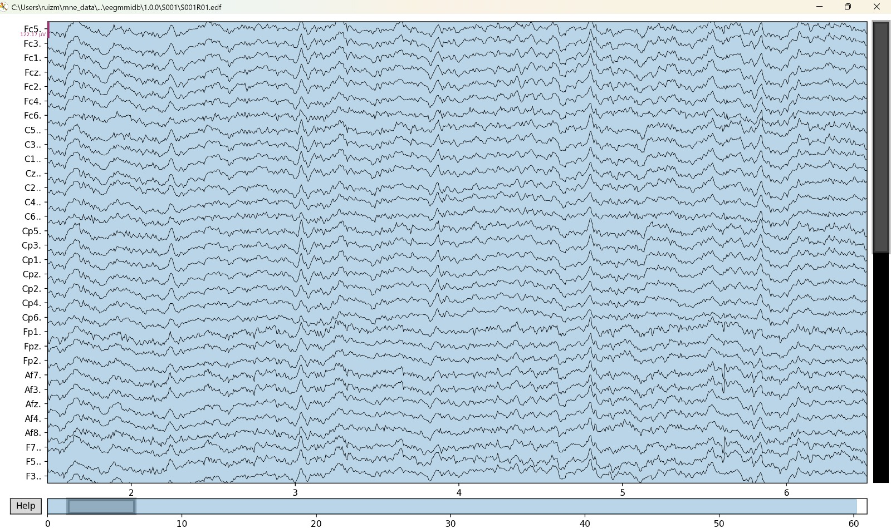
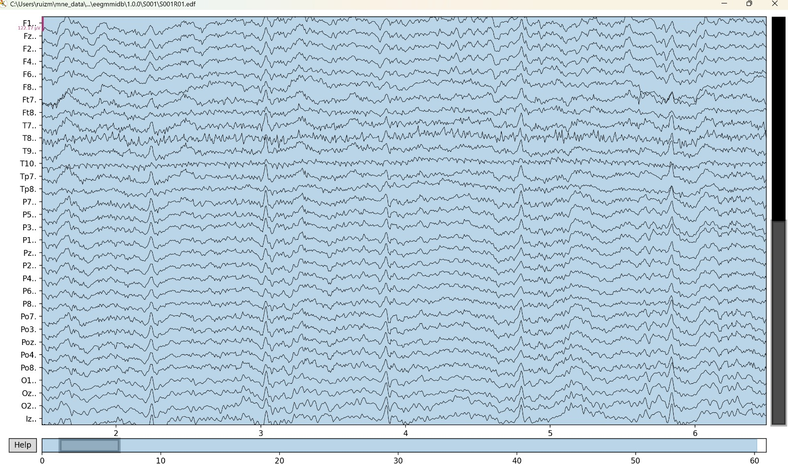

# 🧠 Análisis EEG para Imaginación Motora (EEGBCI)

Este documento presenta el flujo completo de procesamiento de señales EEG del dataset EEG Motor Movement/Imagery (PhysioNet), desde la carga de datos hasta la clasificación de tareas mentales mediante aprendizaje automático.

---

## . 📥 Origen de los Datos

- **Dataset:** EEG Motor Movement/Imagery Dataset  
- **Fuente:** [https://physionet.org/content/eegmmidb/1.0.0/](https://physionet.org/content/eegmmidb/1.0.0/)
- **Sujeto:** 1
- **Runs utilizados:** 3 (mano izquierda), 4 (derecha), 7 (imaginación bilateral)
- **Electrodos:** 64 canales
- **Frecuencia de muestreo:** 160 Hz
- **Formato:** EDF (.edf)

---
### 1. Carga y visualización de la señal cruda

Se cargan los archivos `.edf` del dataset EEGBCI y se visualiza la señal sin filtrar.

### Paciente 1:
| Actividad                 | Señal Filtrada                |
|-----------------------|--------------------|
| Basal 1               | |
| Basal 2     ||
| Tarea 1     ||
| Tarea 2 ||
| Tarea 3 ||
| Tarea 4 ||
<div align="center">
  
  <br><em>Visualización de las señales crudas: se observa ruido y artefactos fisiológicos.</em>
</div>

<div align="center">
  
  <br><em>Otra vista de los canales antes de cualquier filtrado o procesamiento.</em>
</div>

---

## 2. 🧼 Procedimiento de Preprocesamiento

### 2.1 Filtros Aplicados
- **Notch filter** a 50 Hz para eliminar interferencia eléctrica.
- **Bandpass filter** entre 1–40 Hz para aislar componentes relevantes del EEG.

### 2.2 Corrección de Artefactos
- **ICA (Análisis de Componentes Independientes)** para remover artefactos (por ejemplo, parpadeos y movimientos musculares).
- Se identificaron y eliminaron 2 componentes sospechosos (ICA000, ICA001).

**Visualización de los componentes ICA:**


---

## 3. ⚙️ Extracción y Segmentación de Características

### 3.1 Eventos y Segmentación
- Se detectaron eventos desde el canal `"STI 014"`.
- Clases detectadas: `T0`, `T1`, `T2`.
- Se generaron *epochs* desde -200 ms hasta +500 ms respecto a cada evento.

### 3.2 ERP Promedio
- Se calculó y visualizó el promedio de señal para la clase `'tarea1'`.


### 3.3 Visualización de señal preprocesada
- Ejemplo del EEG tras filtros y corrección por ICA:


---

## 4. 📊 Extracción de Características

- Se aplicó Welch PSD a cada canal y se agruparon potencias por bandas de frecuencia:
  - Delta (1–4 Hz)
  - Theta (4–8 Hz)
  - Alpha (8–12 Hz)
  - Beta (12–30 Hz)
  - Gamma (30–40 Hz)

- Cada muestra incluye 320 características (64 canales × 5 bandas).
- Se creó el archivo `caracteristicas_EEG.csv`.

---

## 5. 🤖 Clasificación y Optimización

### 5.1 Clasificación Base
- Se utilizó un clasificador **Random Forest**.
- División: 70% entrenamiento / 30% test.

### 5.2 Normalización y PCA
- **Estandarización:** `StandardScaler`.
- **Reducción de dimensionalidad:** PCA (10 componentes).
- Visualización 2D con primeras dos componentes:


### 5.3 Evaluación del modelo
- Métricas calculadas:
  - Precisión (accuracy) sin PCA.
  - Precisión con PCA.
  - Validación cruzada 5-fold.
  - Matriz de confusión:


---

## 6. 📁 Archivos Generados

| Archivo                           | Descripción                                 |
|----------------------------------|---------------------------------------------|
| `sujeto01_run01_preprocesado_raw.fif` | Señal cruda preprocesada              |
| `sujeto01_run01-epo.fif`         | Datos segmentados (epochs)                  |
| `sujeto01_run01-ave.fif`         | ERP promedio calculado                      |
| `caracteristicas_EEG.csv`        | Características por bandas y canal          |
| `ICA_componentes.png`            | Topografías de los componentes ICA          |
| `Evoked_tarea1.png`              | ERP promedio de tarea1                      |
| `EEG_crudo.png`                  | EEG crudo preprocesado                      |
| `pca_visualizacion_2D.png`       | Visualización de PCA                        |
| `matriz_confusion_pca.png`       | Evaluación de clasificación                 |

---

## 7. ✅ Conclusiones

- El pipeline permite preparar datos EEG de forma robusta para clasificación automática.
- Las técnicas de limpieza (ICA) y transformación (PCA) fueron efectivas.
- El modelo Random Forest logró una precisión considerable sobre tareas imaginadas.
- El proceso puede extenderse a más sujetos y tareas para mejorar generalización.

---

## 8. 💻 Código Fuente
## Código sin comentarios

```python
import os
import mne
from mne.datasets import eegbci
from mne.io import read_raw_edf
from mne.preprocessing import ICA
from mne.time_frequency import psd_array_welch

from sklearn.preprocessing import StandardScaler
from sklearn.decomposition import PCA
from sklearn.metrics import confusion_matrix, ConfusionMatrixDisplay, accuracy_score
from sklearn.model_selection import cross_val_score, train_test_split
from sklearn.ensemble import RandomForestClassifier

import matplotlib.pyplot as plt
import numpy as np
import pandas as pd

save_dir = r"C:\Apple\2025-1\Señales\proyecto de clase"
os.makedirs(save_dir, exist_ok=True)

subject = 1
runs = [3, 4, 7]
files = eegbci.load_data(subject, runs)
raw = mne.concatenate_raws([read_raw_edf(f, preload=True) for f in files])
mne.datasets.eegbci.standardize(raw)
montage = mne.channels.make_standard_montage("standard_1005")
raw.set_montage(montage)

raw.notch_filter(freqs=50)
raw.filter(l_freq=1.0, h_freq=40.0)

ica = ICA(n_components=20, random_state=97, max_iter=800)
ica.fit(raw)
ica.exclude = [0, 1]
raw.load_data()
ica.apply(raw)

raw_file = os.path.join(save_dir, "sujeto01_run01_preprocesado_raw.fif")
raw.save(raw_file, overwrite=True)
print("RAW preprocesado guardado.")

events, event_id_map = mne.events_from_annotations(raw)
print("Eventos detectados:", events[:10])
print("Mapeo de etiquetas:", event_id_map)

event_id = {key: event_id_map[key] for key in event_id_map if key in ["T0", "T1", "T2"]}
epochs = mne.Epochs(raw, events, event_id=event_id, tmin=-0.2, tmax=0.5, baseline=(None, 0), preload=True)

epochs_file = os.path.join(save_dir, "sujeto01_run01-epo.fif")
epochs.save(epochs_file, overwrite=True)
print("Epochs guardados.")

first_label = list(event_id.keys())[0]
evoked = epochs[first_label].average()
evoked_file = os.path.join(save_dir, "sujeto01_run01-ave.fif")
evoked.save(evoked_file)
print("ERP promedio guardado.")

ica.plot_components(show=True)
plt.savefig(os.path.join(save_dir, "ICA_componentes.png"))
print("Gráfico de ICA guardado.")

evoked.plot()
plt.savefig(os.path.join(save_dir, "Evoked_tarea1.png"))
print("Gráfico Evoked guardado.")

data = epochs.get_data()
psds = []
for trial in data:
    trial_psd = []
    for ch_data in trial:
        psd, freqs = psd_array_welch(ch_data, sfreq=raw.info['sfreq'], fmin=1, fmax=40, n_fft=256)
        trial_psd.append(psd)
    psds.append(np.array(trial_psd))
psds = np.array(psds)

bands = {
    "delta": (1, 4),
    "theta": (4, 8),
    "alpha": (8, 12),
    "beta": (12, 30),
    "gamma": (30, 40),
}

features = []
for trial_psd in psds:
    trial_feats = []
    for band_range in bands.values():
        idx = np.logical_and(freqs >= band_range[0], freqs <= band_range[1])
        power = np.sum(trial_psd[:, idx], axis=1)
        trial_feats.extend(power)
    features.append(trial_feats)

X = pd.DataFrame(features)
y = epochs.events[:, 2]
X["label"] = y

X.to_csv(os.path.join(save_dir, "caracteristicas_EEG.csv"), index=False)
print("CSV de características guardado.")

X_data = X.drop(columns=["label"])
y_data = X["label"]

X_train, X_test, y_train, y_test = train_test_split(X_data, y_data, test_size=0.3, random_state=42)

clf = RandomForestClassifier()
clf.fit(X_train, y_train)
y_pred = clf.predict(X_test)

acc = accuracy_score(y_test, y_pred)
print(f"Precisión del modelo: {acc:.2f}")

scaler = StandardScaler()
X_scaled = scaler.fit_transform(X_data)

pca = PCA(n_components=10)
X_pca = pca.fit_transform(X_scaled)

X_train, X_test, y_train, y_test = train_test_split(X_pca, y_data, test_size=0.3, random_state=42)
clf = RandomForestClassifier()
clf.fit(X_train, y_train)
y_pred = clf.predict(X_test)

acc_pca = accuracy_score(y_test, y_pred)
print(f"Precisión con PCA: {acc_pca:.2f}")

X_pca_2d = X_pca[:, :2]
plt.figure(figsize=(8, 6))
for label in np.unique(y_data):
    plt.scatter(X_pca_2d[y_data == label, 0],
                X_pca_2d[y_data == label, 1],
                label=f'Tarea {label}', alpha=0.6)
plt.xlabel("PCA 1")
plt.ylabel("PCA 2")
plt.title("Proyección 2D EEG con PCA")
plt.legend()
plt.grid(True)
plt.tight_layout()
plt.savefig(os.path.join(save_dir, "pca_visualizacion_2D.png"))
plt.show()
print("Gráfico PCA 2D guardado.")

cm = confusion_matrix(y_test, y_pred)
disp = ConfusionMatrixDisplay(confusion_matrix=cm, display_labels=clf.classes_)
disp.plot(cmap='Blues')
plt.title("Matriz de Confusión (Clasificación con PCA)")
plt.tight_layout()
plt.savefig(os.path.join(save_dir, "matriz_confusion_pca.png"))
plt.show()
print("Matriz de confusión guardada.")

scores = cross_val_score(clf, X_pca, y_data, cv=5)
print(f"Validación cruzada (5-fold): precisión media = {scores.mean():.2f}")

print("\nArchivos en la carpeta de salida:")
for archivo in os.listdir(save_dir):
    print(" -", archivo)

print("\nPROCESO COMPLETADO")
```
