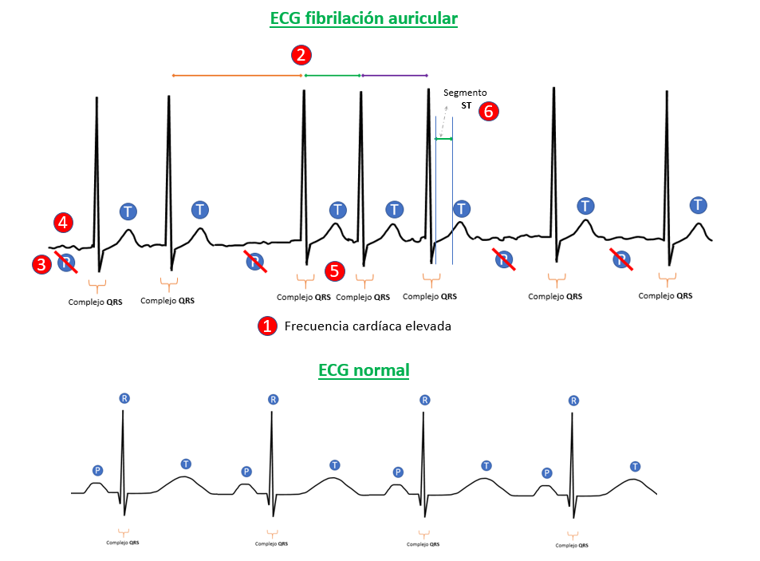
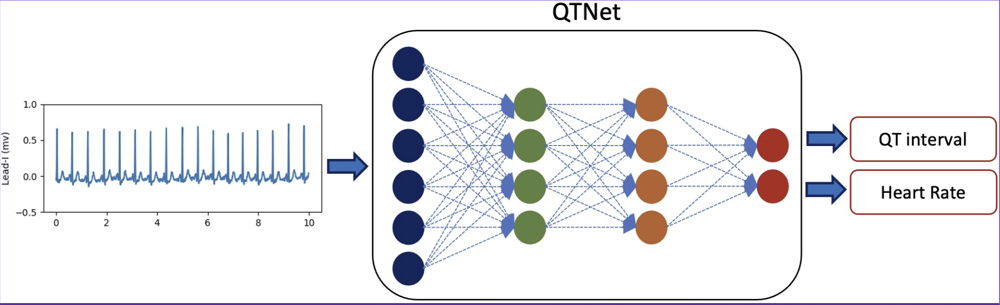
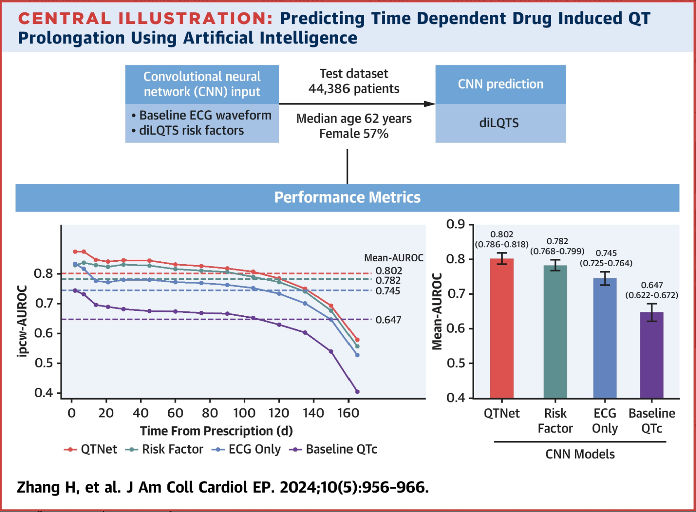
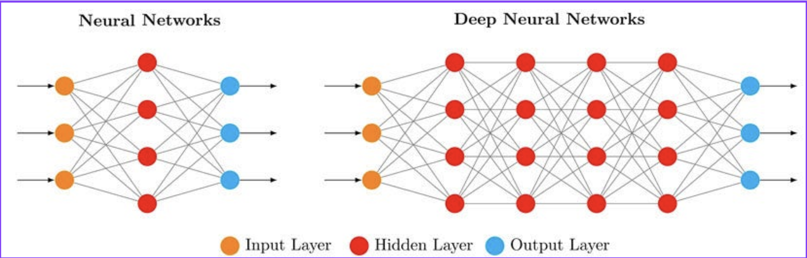
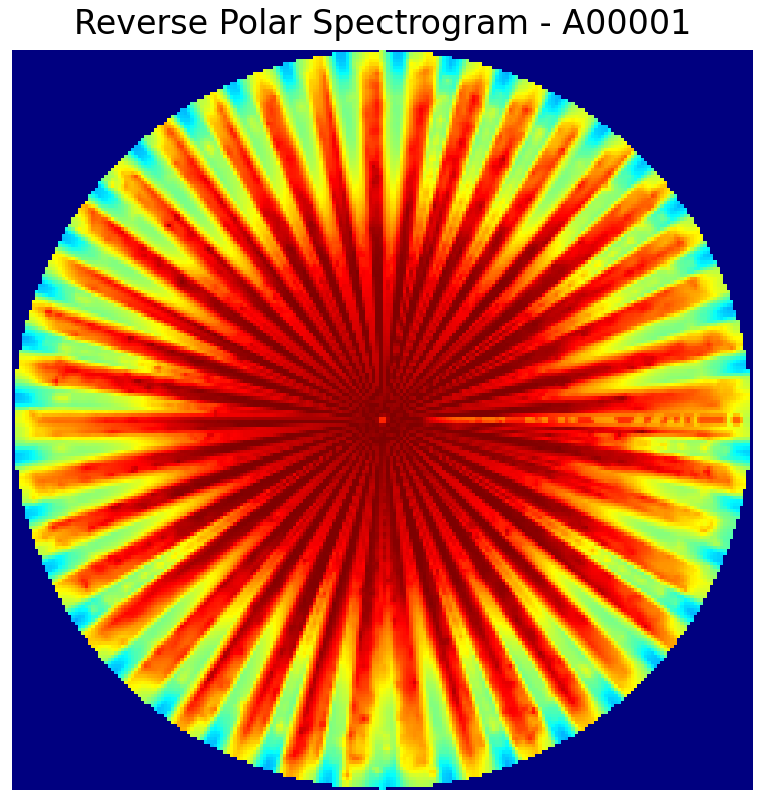

# 🧠 Proyecto: Sistema Predictivo de Fibrilación Auricular Basado en Deep Learning

## 📄 Introducción

La **fibrilación auricular (FA)** es la arritmia cardíaca más común en el mundo. Afecta aproximadamente a 33.5 millones de personas globalmente y su prevalencia aumenta con la edad, alcanzando hasta un 12% en mayores de 80 años. 

Esta condición puede presentarse sin síntomas, pero está asociada a riesgos significativos como:

- Accidente cerebrovascular (ACV)
- Insuficiencia cardíaca
- Coágulos sanguíneos
- Pérdida cognitiva progresiva

**Factores de riesgo principales:**
- Edad avanzada
- Obesidad
- Diabetes mellitus
- Genética

---

## ⚡️ Problemática

El diagnóstico temprano de FA es difícil debido a su naturaleza intermitente. Muchos pacientes son diagnosticados tras un evento agudo como un ACV.

Los sistemas tradicionales de monitoreo continuo son costosos, invasivos o poco precisos.

Por ello, se necesita un sistema de **detección automática y temprana**, con alta sensibilidad y que funcione incluso en registros ECG simples de una sola derivación.

> 

---

## 🔗 Tema General

**Desarrollo de un modelo de deep learning que utilice transformaciones tiempo-frecuencia de señales ECG (en formato polar) para detectar fibrilación auricular.**

Usamos una combinación de:
- Preprocesamiento Pan-Tompkins
- STFT para obtener espectrogramas
- Transformación polar de las imágenes
- Clasificación con redes neuronales convolucionales (CNN)

> 

---

## 🌐 Estado del Arte

### 1. **QTNet (Alam et al., 2024 - PubMed ID: 38703162)**
- Red convolucional profunda entrenada con 12 derivaciones de ECG y variables clínicas (como uso de fármacos, historial, etc.) para predecir prolongación del intervalo QT.
- Evaluada en más de 44,000 pacientes. Mantiene AUROC de 0.80 incluso 6 meses después de la toma de datos.
- Considera la variabilidad temporal del riesgo, con generalización clínica importante.

> 

---

### 2. **Bos et al. (Mayo Clinic, 2025)**
- CNN desarrollada para diferenciar QT largo congénito de adquirido.
- Evaluada con ECG de 12 derivaciones y validada con datos de pacientes clínicos.
- Métricas: Precisión: 85%, Sensibilidad: 77%, Especificidad: 87%.
- Uso de DNN mejora clasificación automatizada sin intervención humana.

> 

---

### 3. **Marcapasos vs DAI (Cleveland Clinic)**
- **Marcapasos**: tratan bloqueo AV y bradicardias, pero no predicen FA.
- **DAI (Desfibrilador Automático Implantable)**: detectan y revierten arritmias graves como taquicardia ventricular o FA.
- Ambos dispositivos son invasivos, requieren cirugía y seguimiento médico estricto.

> 
---

## 📅 Propuesta de Solución

**Objetivo:** Crear un sistema ligero, portátil y preciso de detección de FA que no dependa de monitoreo continuo costoso.

**Componentes:**
1. Adquisición ECG (una derivación)
2. Filtro Pan-Tompkins
3. STFT (Short-Time Fourier Transform)
4. Transformación polar del espectrograma
5. Clasificación por CNN (MobileNet o ResNet)

> 

**Ventajas:**
- Portabilidad
- Bajo costo computacional
- Interfaz simple para personal de salud
- Aplicabilidad en contextos rurales o sin acceso a hospitales grandes

---

## 🔬 Metodología

**Paso 1:** Preprocesamiento ECG
- Pan-Tompkins para detección de QRS
- Normalización y limpieza de artefactos

**Paso 2:** Extracción de Características
- STFT para espectrograma tiempo-frecuencia
- Transformación polar (warp_polar)

**Paso 3:** Modelado CNN
- Entrenamiento con MobileNetV2 o ResNet50
- Clasificación binaria (FA / no FA)

**Paso 4:** Evaluación
- Accuracy, F1-score, matriz de confusión, AUC

> 

---

## 📚 Referencias

1. [Mayo Clinic – FA](https://www.mayoclinic.org/es/diseases-conditions/atrial-fibrillation/symptoms-causes/syc-20350624)  
2. Sagris M. et al. (2021) [MDPI - Pathogenesis FA](https://www.mdpi.com/1422-0067/23/1/6)  
3. QTNet (PubMed ID: 38703162) [PLOS Digit Health](http://dx.doi.org/10.1371/journal.pdig.0000539)  
4. Bos JM et al. (2025) [Mayo Clinic Proc](http://dx.doi.org/10.1016/j.mayocp.2024.07.016)  
5. [PhysioNet](https://physionet.org)  
6. [Cleveland Clinic - Marcapasos](https://my.clevelandclinic.org/health/treatments/17360-permanent-pacemaker)  
7. [Cleveland Clinic - DAI](https://my.clevelandclinic.org/health/treatments/17123-implantable-cardioverter-defibrillator-icd)

---

## 🙏 Gracias por su atención
> 

