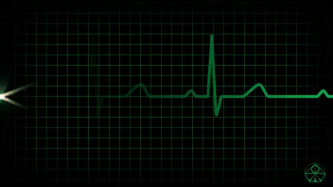
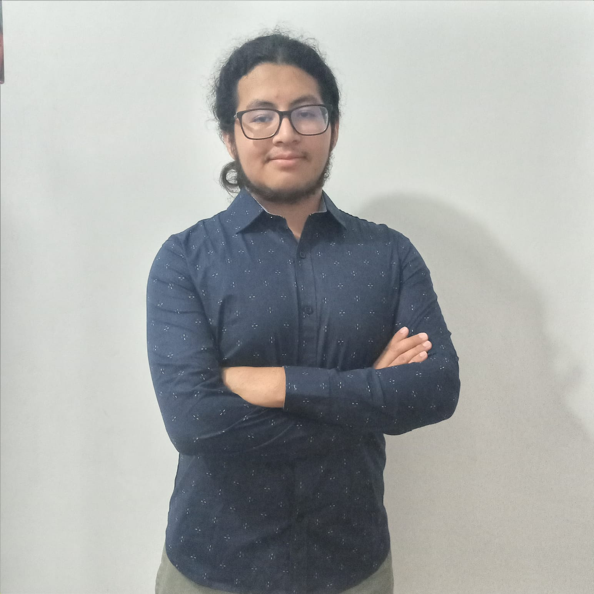
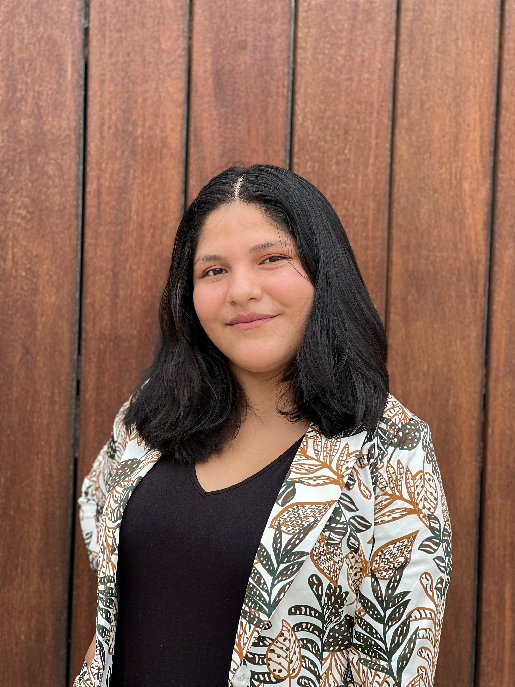
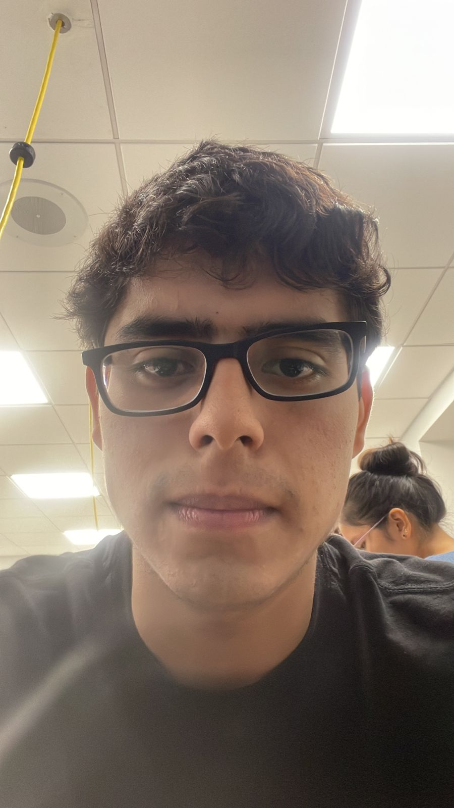
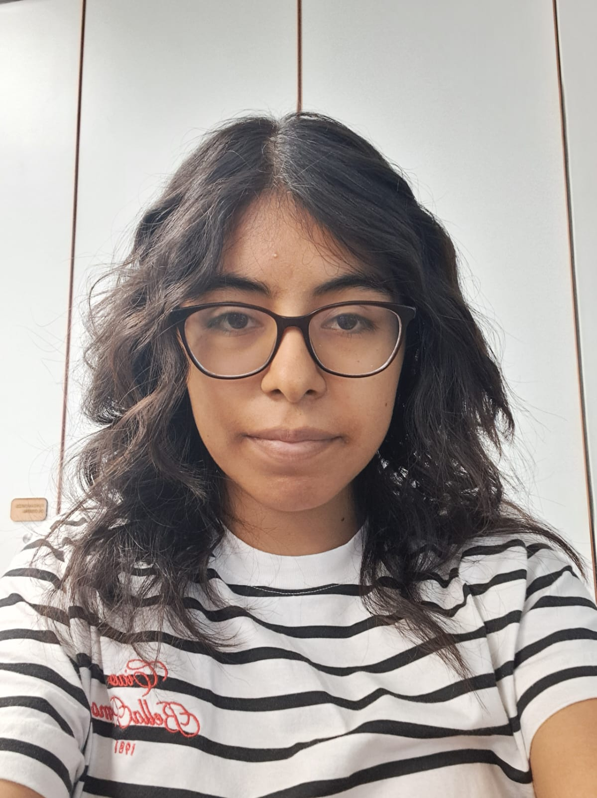

Ayuda

  

   
# Tabla de contenidos 
- [Participantes](#participantes)

## Participantes
- 

| Foto          | Descripción   |
| ------------- | ------------- |
|   | Brayam Lazares, estudiante de IB con interés en biomecánica y señales cerebrales par aaplicaciones en dispositivos Brain-computer-Interface (BCI). Mis expectativas del curso recane en mejorar mis habilidades para obtener y procesar señales biomédicas |
|   | Eliane Loza, estudiante de la carrera de Ingeniería Biomedica con interés en especialización en procesamiento de señales e imagenes médicas. Tengo muchas espectativas referido al curso y al ciclo en general porque es una oportunidad para mi formación profesional el adquirir información tecnica y practicar nuevos conocimientos |
|    | Jose Otoya, estudiante de IB, estusiasta de la inteligencia artificial, tengo expectativas sobre este curso. |
|   | Margareth Olazabal, estudiante de Ingeniería Biomédica con interés en Ingeniería de Tejidos. Del curso espero obtener una visión más amplia sobre lo que se puede lograr a partir de las señales biomédicas. |
|   | Joseph estudiante,estudainte de la carrera de Ingeniería Biomédica el cual esta estudiando el curso de Introducción de señales Biológicas,tengo interés en las áres de equipos médicos  e ingeniería clínica.Busco aprender  de todas las ramas posibles de todos los cursos para así foramar integramente.  |
