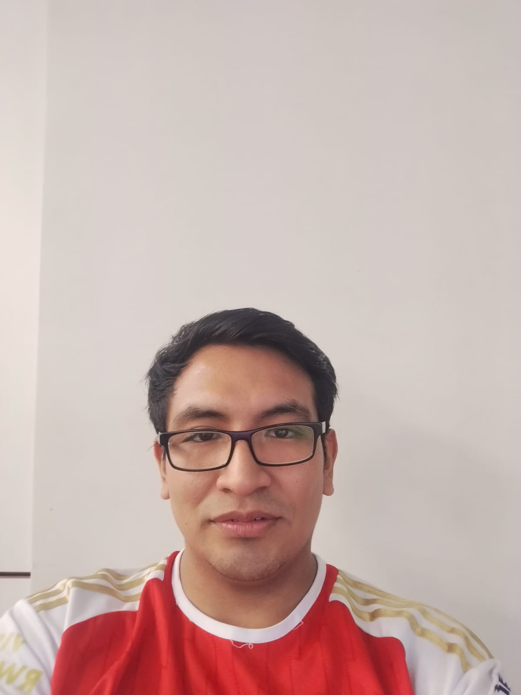

Ayuda
1. Qué se espera del curso
2. Presentación de cada miembro: interepes, sueños y esperanzas xd
# Tabla de contenidos 
- [Participantes](#participantes)

## Participantes
- 

| Foto          | Descripción   |
| ------------- | ------------- |
|   | Brayam Lazares, estudiante de IB con interés en biomecánica y señales cerebrales par aaplicaciones en dispositivos Brain-computer-Interface (BCI). Mis expectativas del curso recane en mejorar mis habilidades para obtener y procesar señales biomédicas |
|   | Eliane Loza,eliane.loza@upck.pe Estudiante de la carrera de Ingeniería Biomedica con interés en especialización en procesamiento de señales e imagenes médicas. Tengo muchas espectativas referido al curso y al ciclo en general porque es una oportunidad para mi formación profesional el adquirir información tecnica y practicar nuevos conocimientos |
|    | Jose Otoya, estudiante de IB, estusiasta de la inteligencia artificial, tengo expectativas sobre este curso. |
|   | Margareth Olazabal |
|   | Joseph estudiante  |
